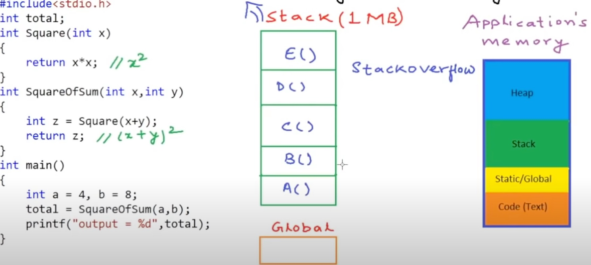

# Pointer in C

- [Pointer in C](#pointer-in-c)
  - [Introduction to Pointer in C](#introduction-to-pointer-in-c)
    - [What is Pointer?](#what-is-pointer)
    - [Builtin Data types](#builtin-data-types)
    - [Using a Pointer](#using-a-pointer)
    - [Pointer Arithmetic](#pointer-arithmetic)
    - [Pointer types, and void Pointer](#pointer-types-and-void-pointer)
    - [Pointer to Pointer](#pointer-to-pointer)
    - [Pointer as function argument](#pointer-as-function-argument)
    - [Pointer and Array](#pointer-and-array)
    - [Arrays as functiona arguments](#arrays-as-functiona-arguments)
    - [Character (char) Arrays and Pointers](#character-char-arrays-and-pointers)
    - [Pointers and Multi-dimensional Arrays](#pointers-and-multi-dimensional-arrays)
    - [Pointer and dynamic memory (DMA)](#pointer-and-dynamic-memory-dma)
    - [Functions for DMA in C/C++](#functions-for-dma-in-cc)
      - [1. Function `malloc()`](#1-function-malloc)
      - [2. Function `calloc()`](#2-function-calloc)
      - [3. Function `realloc()`](#3-function-realloc)
      - [4. Function `free()`](#4-function-free)
    - [Pointers as function returns](#pointers-as-function-returns)

## Introduction to Pointer in C

### What is Pointer?

- The Pointer in C, is a variable that stores address of another variable.
- A pointer can also be used to refer to another pointer function.
- A pointer can be incremented/decremented,
  - i.e., to point to the next/ previous memory location.

---

### Builtin Data types

- int type is `4 bytes`
- char type is `1 byte`
- float type is `4 bytes`
- Each byte have an address in memory


---

### Using a Pointer

- Using a pointer
- `* operator` is the indirection operator, to declare a pointer
- To get the address of a variable, we use the ampersand `& operator`


- Declare A pointer `int *p` points to an int variable `int a`, `p = &a`
  the pointer `p` **MUST** be int type,
- `&a` contains the address of the variable `a`
- `p` and `&a` have same address, `p = &a`, in the example is 204
- `&p` contains the address of the variable `p`, `&p == 64`
- `*p` get the value, `*p = a` or dereferencing
- `p->` the address of `a`, `*p->` the value at address of `a`

```c
#include <stdio.h>
int main(int argc, char const *argv[])
{
    int a = 5;  //variable declaration
    int *p = &a;             // the address of a, or p = &a
    printf("a = %d\n", a);   // a = 5
    *p = 12;                 // dereferencing, same as a = 12
    printf("p = %p\n", p);   //  p = &a the address of a
    printf("&p = %p\n", &p); // &p = the address of pointer p
    // printf("p = %x\n", p);
    printf("*p = %d\n", *p); // *p = 12
    printf("a = %d\n", a); // a = 12
    printf("&a = %p\n", &a); // p == &a, the address of a
    return 0;
} // main
```

---

### Pointer Arithmetic

- Pointer increment/decrement
- The point `int* p` is pointed to the address of the variable `a`
  `int* p = &a` , `p+1` will be increased by **4 bytes** i.e. p = 2002, p+1 = 2002+4
- Pointer `p` MUST pointed to an address of variable before using it,
  `p` contains the address of a, the address of a will be increased by 4 bytes

```c
#include <stdio.h>
int main(int argc, char const *argv[])
{
    int a = 10;
    int *p = &a;
    // Pointer Arithmetic
    printf("p = %p\n", p); // p = 2002
    // show size of int type
    printf("size of int is: %ld bytes\n", sizeof(int));
    printf("p+1 = %p\n", p + 1); // p+1 = 2006

    return 0;
} // main

```

---

### Pointer types, and void Pointer

- `int` is `4 bytes`, `char` is `1 byte`, `float` is `4 bytes`
- Why strong types, `int* -> int` of `char* -> char`
  - Pointer is NOT ONLY storing addresses. Also, Dereferencing
  - Dereference, easy to access/ modify value of the variable
- Each `Bytes` in memory is addressable, such 200, 201, ... for each byte
- Why not generic types?


```c
#include <stdio.h>
int main(int argc, char const *argv[])
{
    /* code */
    int a = 1025;
    int *p;
    p = &a;                                                 // pointer p = the address of a
    printf("size of integer is %d bytes \n", sizeof(int));  // 4 byts
    printf("pointer p, Address = %d, value = %d\n", p, *p); // p is address, *p is value
    // p + 1
    printf("p + 1, Address = %d, value = %d\n", p + 1, *(p + 1));
    // p + 1 address increases, *(p + 1) is the value in the address (p + 1)

    /* typecasting */
    char *p0;                                           // p0 is the char pointer
    p0 = (char *)p;                                     //  type casting int pointer p
    printf("size of char is %d byte \n", sizeof(char)); // char is 1 byte
    printf("Address = %d, value = %d\n", p0, *p0);
    printf("Address = %d, value = %d\n", p0 + 1, *(p0 + 1));
    // The char pointer p0 has same address with int pointer p,
    // *p0 has the value of a, but *p0 is char type, (casttyping)
    // why the value of *p0 is 1?
    // 1025 in 32-bit binary  0000 0000 0000 0000 0000 0100 0000 0001
    // typecasting made p0 to 0000 0001 (char is 1 byte or 8 bits)

    /* void pointer is a kind of generic pointer. */
    void *p1;
    p1 = p; // void pointer p1 has same addres with int pointer p
    printf("The void* p1, Address = %d\n", p1);
    printf("p= %d\n", p);
    return 0;
} // main
```

---

### Pointer to Pointer

- Pointer can point to a pointer


```c
#include <stdio.h>
int main(int argc, char const *argv[])
{
    /* pointer to pointer */
    int x = 5;
    int *p = &x; // pointer p has the a's address
    *p = 6;      // change a's value, same as a = 6;
    // declare a pointer points to a pointer
    int **q = &p;  // pointer q has the pointer a's address
    int ***r = &q; // pointer r has the pointer q's address

    printf("p contains x's address = %d\n", p);   // x's address 225
    printf("*p has x's value = %d\n", *p);        // *p = 6, so x = 6
    printf("*q contains x's address = %d\n", *q); // x's address 225
    printf("*(*q) has x's value = %d\n", *(*q));  // has x's value 6
    printf("**q = %d\n", **q);                    // *(*q) **q are the same.
    // printf("**q = %d\n", );
    printf("*(*r) contains x's address = %d\n", *(*r)); // x's address 225
    printf("*(*(*r)) has x's value = %d\n", *(*(*r)));  // has x's value 6

    **q = *p + 100;        // 6 + 100
    printf("x = %d\n", x); // x = 106

    ***r = 200;
    printf("x = %d\n", x); // x = 200

    **q = *p + 2;
    printf("x = %d\n", x);
    return 0;
} // main
```

---

### Pointer as function argument

- `a -> x` is **call by value**


- call by reference


```c
#include <stdio.h>

void increment(int *p)
{
    *p = (*p) + 1; // x's value increased by 1
}
int main(int argc, char const *argv[])
{
    /* code */
    int a = 10;
    printf("Before call increment method a = %d\n", a);
    increment(&a);
    printf("After call increment method a = %d\n", a);
    return 0;
} // main

```

---

### Pointer and Array

- The array represented in the memory
- `int` is 4 bytes, the array A[5] has 5 elements. the size of the A[5] is 4 x 5 = 20 bytes
- Two diagrams to represent array in memory (see image)


- `int` type variable in the memory represented in horizontally


- `int` type Array in memory


- Methods to iterating Addresses of a array

  - `&A[i]`, and `(A+i)`

  -

- Methods to iterating Values in a array
  - `A[i]`, and `*(A + 1)`

```c
#include <stdio.h>
int main(int argc, char const *argv[])
{
    /* Array in the memory */
    int A[] = {2, 4, 5, 8, 1};
    int *p = A; // same as int *p = A[0]
    // A++; // A++ is invalid
    // p++; // valid
    for (int i = 0; i < 5; i++)
    {
        // addresses of each element of the array
        printf("Address = %d\n", &A[i]); // &A[0] the starting address of the array A
        printf("Address = %d\n", A + i);

        // values of each array element
        printf("value = %d\n", A[i]);
        printf("value = %d\n", *(A + i));
    } // for
    return 0;
} // main
```

---

### Arrays as functiona arguments

- The Array Passes by reference

-


```c
#include <stdio.h>
/**
 * Function doubleElement()
 *
 */
void doubleElement(int *A, int size)
{
    int i, doubleSum = 0;
    for (i = 0; i < size; i++)
    {
        A[i] = 2 * A[i];
    }
} // doubleElement

/**
 * Function: sumOfElement()
 *  sum up elements in array, return the sum
 *
 *  int A[], same as int* A, the passed array
 *  int size, the passed array's size
 *
 */
int sumOfElement(int *A, int size)
{
    int i, sum = 0;
    printf("SOE - Size of A = %d, size of A[0] = %d\n", sizeof(A), sizeof(A[0]));
    for (i = 0; i < size; i++)
    {
        sum += A[i]; // A[i] == *(A+i)
    }
    return sum;
} // sumOfElement

int main(int argc, char const *argv[])
{
    /* Arrays as function arguments */
    int A[] = {1, 2, 3, 4, 5};
    int size = sizeof(A) / sizeof(A[0]);   // get the size of the array
    int total = sumOfElement(&A[0], size); // &A[0] is address
    // call the function sumOfElement, the array passes by reference and the array's size
    printf("the sum of all element in the array: %d\n", total);
    printf("Main - Size of A = %d, size of A[0] = %d\n", sizeof(A), sizeof(A[0]));

    // call the function doubleElement()
    doubleElement(&A[0], size);
    for (int i = 0; i < size; i++)
    {
        printf("%d ", A[i]);    // 2 4 6 8 10
    }

    return 0;
} // main
```

---

### Character (char) Arrays and Pointers

- String type: A group of characters
  e.g "John", "Hello World"
- How to store strings in an array
  - char C[5] = "JOHN";
  - char C[5] = {'J', 'O', 'H', 'N', '\0'};
  - char C[5]; C = 'J'; c[1] = 'o'; c[2] = 'h'; c[3] = 'n' c[4] = '\0';
- char type == 1 byte == 8 bits

  - **size of aray** >= no. of characters in string + 1
  - e.g. "John" is 4 characters, size >= 5

- RULE: A string in C has to be null-terminated, the ending with `'\0'`

```c
  char c[5];
  c[0] = 'J'; c[1] = 'o'; c[2] = 'h'; c[3] = 'n' c[4] = '\0';
```

  

- if the length of the char array`char C[4]` is 4, and without '\0'

  - the print out result will be something like `JOHN�?��`
  - b/c it violated the null-terminated rule,

````c
    #include <stdio.h>
    int main(int argc, char const *argv[])
    {
        /* Character arrays and pointers */
        char C[4]; // without '\0',
        C[0] = 'J';
        C[1] = 'O';
        C[2] = 'H';
        C[3] = 'N';
        printf("%s", C); // result JOHN�?��
        return 0;
    } // main
    ```

* with '\0' determined

```c
  #include <stdio.h>
  int main(int argc, char const *argv[])
  {
      /* Character arrays and pointers */
      char C[5]; // length 5
      C[0] = 'J';
      C[1] = 'O';
      C[2] = 'H';
      C[3] = 'N';
      C[4] = '\0';     // with the null-terminated character '\0'
      printf("%s", C); // result "JOHN"
      return 0;
  } // main
````

- Arrays and pointers are different type that are used in similar manner
  

- Arrays are always passed to function by reference

```c
  #include <stdio.h>
  void printChar(char *C)
  {
      int i = 0;
      while (C[i] != '\0') // *(C+i) == C[i]
      {
          printf("%c", C[i]);
          i++;
      } // while
      printf("\n");
  } // printChar
  int main(int argc, char const *argv[])
  {
      char C[20] = "HELLO";
      // call the function printChar()
      printChar(C);
      return 0;
  } // main
```

- The char array C in the `main()` function, and the char pointer in the `print()`
  

```c
  #include <stdio.h>
  #include <string.h>
  // char *C is a pointer which pointed to the array C in main function, can be a const
  void print(const char *C)
  {
      while (*C != '\0')
      {
          printf("%c", *C);
          C++; // char pointer increased
      }
      printf("\n");

  } // print

  int main(int argc, char const *argv[])
  {
      char C[20] = "HELLO."; // string gets stored in the space for array

      // char *C = "HELLO."; // string gets stored as compile time constant
      // C[0] = 'A'; // compile error, if using char *C, b/c it is a constatn.

      // call the print() function to pass array C
      print(C);
      return 0;
  } // main
```

---

### Pointers and Multi-dimensional Arrays

- One-dimensional array and pointer

  - **1-D Array** declaration
  - `int A[5];` 1 ROW, 5 COLUMNS

    

- A multi-dimensional array is an array of arrays
- Two-dimensional array and pointer

  - **2-D Array** declaration
  - `int B[2][3];`, 2 ROWS, 3 COLUMNS. 2x3=6 elements in Array B. 6 x 4 bytes = 24 bytes.
  - `int B[2][3] = {2,3,6,4,5,8};` or `int B[2][3] = {{2,3,6,}, {4,5,8}};`

    

    

    

### Pointer and dynamic memory (DMA)

- The <span style="color:yellow"> **Global variable** </span>is in the <span style="color:yellow"> `Static/Global` area</span>

- Functions in the DMA
  

- When calling functions inside of others in the `Stack`
  
  the function Square() called by the function SquareOfSum(), and the functionSquareOfSum called by the function main. assign the result to the global varialbe "total"

- At the end the function printf() called by the function main()

  ```c
  #include <stdio.h>
  int total; // global variable
  int Square(int x)
  {
      return x * x;
  } // Square

  int SquareOfSum(int x, int y)
  {
      int z = Square(x + y);
      return z;
  } // SquareOfSum

  int main(int argc, char const *argv[])
  {
      int a = 4, b = 8;
      total = SquareOfSum(a, b);
      printf("output = %d\n", total);
      return 0;
  } // main
  ```

- **Stack overflow** in the `Stack` usually happened during bad recurison,
  b/c the size of stack does not grow during runtime

  - Assume Stack is 1MB and funciont calls and the allocation of variables exceed 1 MB. The program will be crushed when the allocaiton and dellocation of memory onto the STACK
    When the function called, it is pushed or popped onto the stack on the top of the stack
    

  - another limitation is that if we need to declare a large data type like an array as local variable
    then we need to know the size of the array at compile time only

  - How to use `Heap` in C/C++

    - Use dynamic memory in C and C++, need to know 4 functions
      `malloc()`, `calloc()`, `realloc()`, and `free()`

    - Use dynamic memory in C++, need to know two operators
      `new`, and `delete`, these are operators
      

- DMA Example
  
  

```c
#include <stdio.h>
#include <stdlib.h>
int main(int argc, char const *argv[])
{
    int a; // local variable goes on stack
    int *p;
    p = (int *)malloc(sizeof(int));
    // malloc function, how much memory to allocate on the heap in bytes
    // pass the sizeoof int type
    *p = 10;
    free(p); // one call for malloc(), one free() for it
    p = (int *)malloc(sizeof(int));
    *p = 20;
    free(p);
    p = (int *)malloc(20 * sizeof(int));

    return 0;
} // main

/*
// dma in c++
int main(int argc, char const *argv[])
{
    int a; // local variable goes on stack
    int *p;
    p = new int;
    *p = 10;
    delete p;
    p = new int[20];
    delete[] p;

    return 0;
} // main
*/
```

### Functions for DMA in C/C++

- `malloc()`, `calloc()`, `realloc()`, perform memory allocation and `free()`, perform de-allocation. these are functions
  

#### 1. Function `malloc()`

- The C library function void \*malloc(size_t size) allocates the requested memory and returns a pointer to it.
- 

```c
#include <stdio.h>
#include <stdlib.h>
/**
 * Function name: malloc(size_t size)
 * Description: allocates the requested memory and returns a pointer to it
 * Parameter:
 * @size    the size of the memmory block, in bytes.
 * Return: The function returns a pointer to the allocated memory, or NULL if the request fails
 *
 */
int main(int argc, char const *argv[])
{
    int n;
    printf("Enter size of array\n");
    scanf("%d", &n);                         // receives an array
    int *A = (int *)malloc(n * sizeof(int)); // dynamically allocated array
    for (int i = 0; i < n; i++)
    {
        A[i] = i + 1;
    } // for

    for (int i = 0; i < n; i++)
    {
        printf("%d ", A[i]);
    } // for
    free(A);
    return 0;
} // main
```

- :heavy_exclamation_mark: `*p == p[0]`, `*(p+1) == p[1]`

  

#### 2. Function `calloc()`

- The C library function void \*calloc(size_t nitems, size_t size) allocates the requested memory and returns a pointer to it.
- The difference in `malloc` and `calloc` is that malloc does not set the memory to zero where as calloc sets allocated memory to zero.
- `malloc` randomly assign values for each element
- `calloc` assign 0 for each element

```c
#include <stdio.h>
#include <stdlib.h>
/**
 * Function name: calloc(size_t nitems, size_t size)
 * Description: allocates the requested memory and returns a pointer to it
 * Parameter:
 * @nitems  the number of elements to be allocated.
 * @size    the size of the elements
 */
int main(int argc, char const *argv[])
{
    int n;
    printf("Enter size of array\n");
    scanf("%d", &n);                        // receives an array
    int *A = (int *)calloc(n, sizeof(int)); // dynamically allocated array
    for (int i = 0; i < n; i++)
    {
        A[i] = i + 1;
    } // for
    for (int i = 0; i < n; i++)
    {
        printf("%d ", A[i]);
    } // for
    free(A); // relase memory
    return 0;
} // main
```

#### 3. Function `realloc()`

- The C library function void \*realloc(void \*ptr, size_t size) attempts to resize the memory block pointed to by ptr that was previously allocated with a call to malloc or calloc.

#### 4. Function `free()`

### Pointers as function returns
