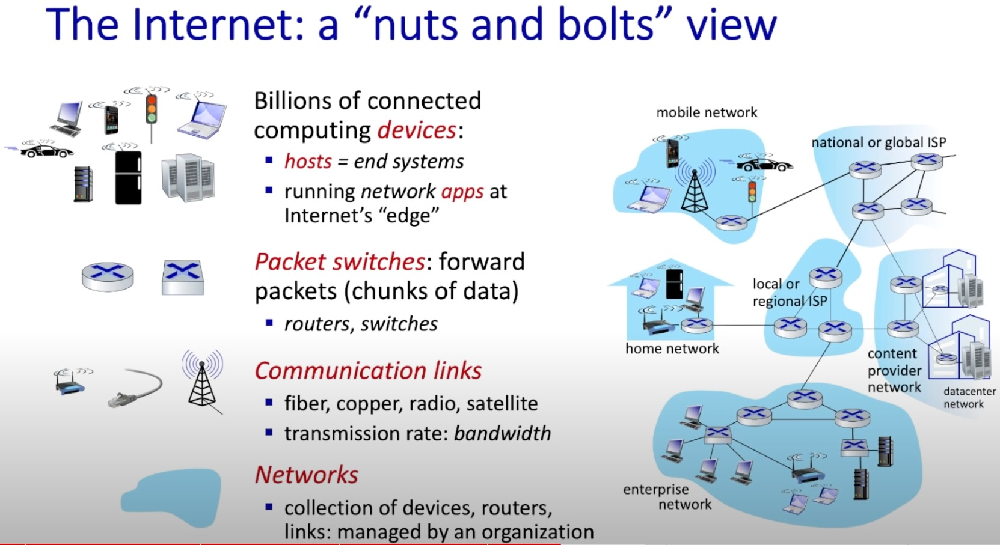
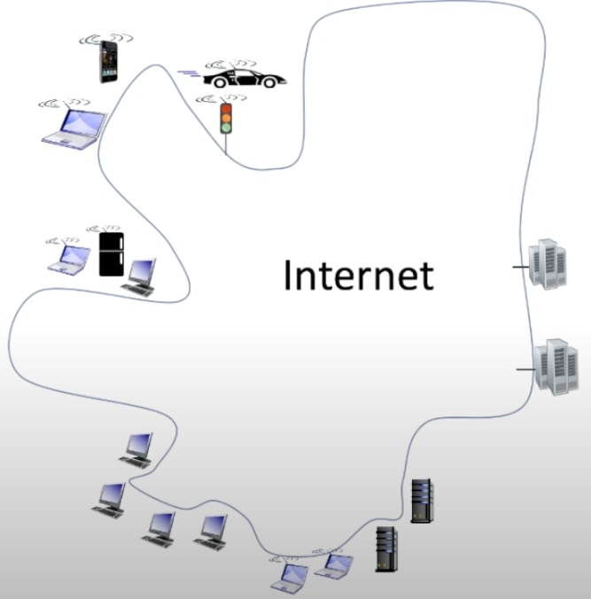
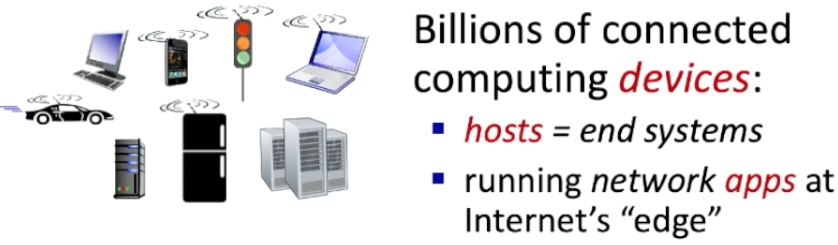
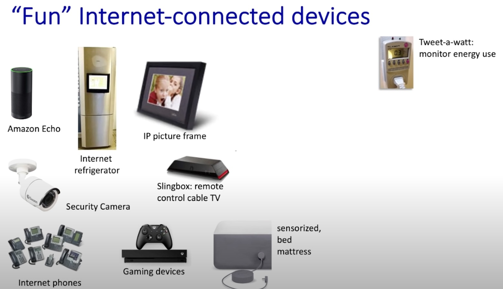

# Chapter 1 Computer Networks and the Internet

## Introduction

### 1.1 What is the Internet? the components of the Internet

- the nuts and bolts of the Internet, Billions of connected computing devices.
  
- the basic hardware and software components that make up the Internet.
  

### 1.2 What is the protocal?

### Network edge

- hosts, access network, physical media
  - hosts = end systems
  - running network `apps` at Internet's "edge"
    
  - "Fun" Internet-connected devices
    

### Network core

- packet/circuit switching internet structure

### Performance

- loss, delay, throughout

### xxxxxx

- Protocol layers, service models
- Security
- History
