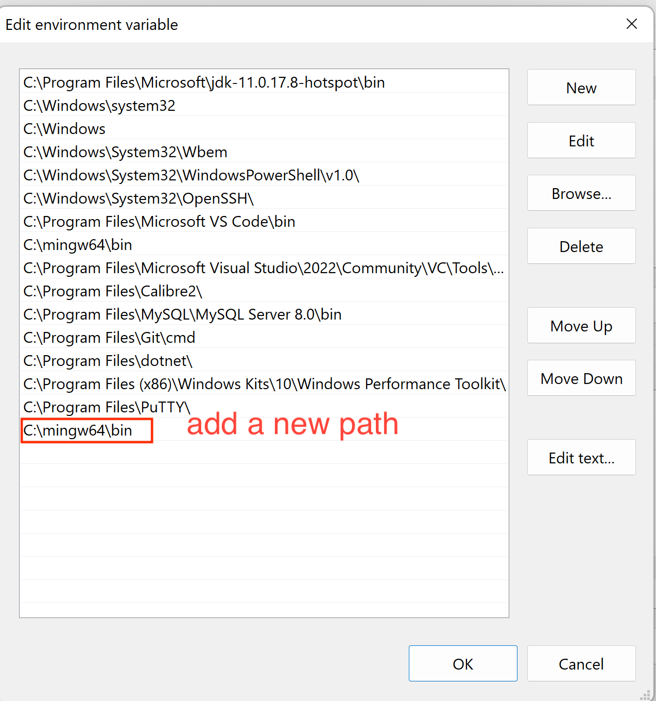
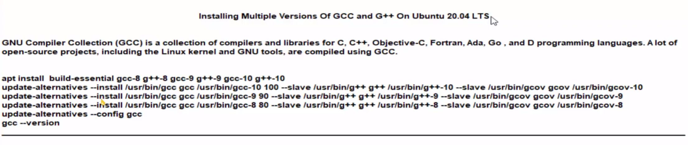

# Linux/Debian Notes

- [Linux/Debian Notes](#linuxdebian-notes)
  - [VSCode C/C++ Development (Windows)](#vscode-cc-development-windows)
    - [mingw64 Configurations for C/C++ (Windows)](#mingw64-configurations-for-cc-windows)
    - [VSCode Configurations for C/C++ (Windows)](#vscode-configurations-for-cc-windows)
    - [Configurations Compilers in the VSCode (Windows)](#configurations-compilers-in-the-vscode-windows)
  - [VSCode C/C++ Development (Linux/Debian)](#vscode-cc-development-linuxdebian)
    - [Install compilers](#install-compilers)
    - [Install VSCode by add the APT Repository](#install-vscode-by-add-the-apt-repository)
    - [Configurations Compilers in the VSCode (Linux/Debian)](#configurations-compilers-in-the-vscode-linuxdebian)
    - [Debian (APT Repository) i386 update error](#debian-apt-repository-i386-update-error)
    - [Check current Linux(Debian) version](#check-current-linuxdebian-version)
    - [Check current IP address](#check-current-ip-address)
  - [Enable SSH for github](#enable-ssh-for-github)
    - [Add a SSH key to Github (Linux/Deiban and macOS)](#add-a-ssh-key-to-github-linuxdeiban-and-macos)
  - [`Path` and `Path` files in macOS](#path-and-path-files-in-macos)
    - [Find out all `Path` files in the macOS](#find-out-all-path-files-in-the-macos)
  - [VSCode C/C++ Development (macOS)](#vscode-cc-development-macos)
    - [Configure the `task.josn` file for C/C++](#configure-the-taskjosn-file-for-cc)
    - [Configure `c_cpp_properties.json`](#configure-c_cpp_propertiesjson)
    - [Configure `.markdownlint.json` file for Markdown](#configure-markdownlintjson-file-for-markdown)
  - [Debian 11 Configurations (2022 updated)](#debian-11-configurations-2022-updated)
    - [Dark theme](#dark-theme)
    - [Terminal Configuration using ZSH as default shell](#terminal-configuration-using-zsh-as-default-shell)
    - [Install `cheat.sh` globally setting](#install-cheatsh-globally-setting)
    - [Change default editor](#change-default-editor)
    - [Web administration default user](#web-administration-default-user)
  - [Configuration for Linux/Debian](#configuration-for-linuxdebian)
    - [1. `Wayland` Setting](#1-wayland-setting)
    - [2. Add a user to **Sudoer** (if needed)](#2-add-a-user-to-sudoer-if-needed)
    - [3. Asian language inputs `fcitx5`](#3-asian-language-inputs-fcitx5)
    - [3.1 Repair `fcitx5` if when it could not start automatically](#31-repair-fcitx5-if-when-it-could-not-start-automatically)
    - [4. config the `sources.list` file](#4-config-the-sourceslist-file)
    - [5. Compilers Configuration or update compilers to latest versions](#5-compilers-configuration-or-update-compilers-to-latest-versions)
    - [6. Install Multiple Pythons](#6-install-multiple-pythons)
    - [7. Install `nala` package manage](#7-install-nala-package-manage)
    - [8. Install `emacs` editor](#8-install-emacs-editor)
    - [9. MySQL (Check MySQL Notes)](#9-mysql-check-mysql-notes)
    - [10. Homebrew for Linux](#10-homebrew-for-linux)
    - [11. Install `cheat.sh`](#11-install-cheatsh)
    - [12. Install Google Chrome](#12-install-google-chrome)
    - [13. Install Microsoft Edge](#13-install-microsoft-edge)
    - [_**(CAUTIONS DATA and TIME MUST BE CORRECT)**_](#cautions-data-and-time-must-be-correct)
    - [14. Install Visual Studio Code and Code insiders](#14-install-visual-studio-code-and-code-insiders)
    - [15. Install Sublime-text](#15-install-sublime-text)
    - [16. Install `OneDrive` for Linux/Debian](#16-install-onedrive-for-linuxdebian)
      - [Step 1: Add the OpenSuSE Build Service repository release key](#step-1-add-the-opensuse-build-service-repository-release-key)
      - [Step 2: Add the OpenSuSE Build Service repository](#step-2-add-the-opensuse-build-service-repository)
      - [Step 3: Update your apt package cache](#step-3-update-your-apt-package-cache)
      - [Step 4: Install 'onedrive'](#step-4-install-onedrive)
      - [Step 5: Read 'Known Issues' with these packages](#step-5-read-known-issues-with-these-packages)
      - [Step 6. Enable OnedriveGUI](#step-6-enable-onedrivegui)
    - [17. yt-dlp download](#17-yt-dlp-download)
    - [18. Configure and Verify Network Connections](#18-configure-and-verify-network-connections)
    - [19. Network configuration files](#19-network-configuration-files)
    - [20. `console-setup` zoom in/out console fonts](#20-console-setup-zoom-inout-console-fonts)

---

## VSCode C/C++ Development (Windows)

### mingw64 Configurations for C/C++ (Windows)

- [Download mingw64](https://winlibs.com/)
- Configure `Environment variables` and `Path` of compilers
  - Press Windows key then type `env`
  - Click `Environment Variables`
  - Click `Path` in the System variables
  - Add the path of `mingw64` to `Path`



### VSCode Configurations for C/C++ (Windows)

- Download it using **winget** tool
- Install VSCode Extensions for C/C++
  1. C/C++ Extension Pack
  2. Code Runner
  3. C/C++ Makefile Project
  4. Makefile Tools
  5. CMake Tools

### Configurations Compilers in the VSCode (Windows)

- Click Terminal to the `Configure Tasks...`
- Select `g++.exe` execution file as the compiler
- Auto generate code in `tasks.json` file

```json
{
  "version": "2.0.0",
  "tasks": [
    {
      "type": "cppbuild",
      "label": "Build with GCC 12.2.0",
      "command": "C:\\mingw64\\bin\\g++.exe",
      "args": [
        "-g",
        "-std=c++20", // using c++20, can be other versions
        "${file}",
        "-o",
        "${fileDirname}\\${fileBasenameNoExtension}.exe"
      ],
      "options": {
        "cwd": "${fileDirname}"
      },
      "problemMatcher": ["$gcc"],
      "group": "build",
      "detail": "compiler: C:\\mingw64\\bin\\g++.exe"
    }
  ]
}
```

- Select `clang++.exe` execution file as the compiler
- Auto generate entry in `tasks.json` file

```json
{
  "type": "cppbuild",
  "label": "Build with clang++ 14.0.6",
  "command": "C:\\mingw64\\bin\\clang++.exe",
  "args": [
    "-g",
    "-std=c++20",
    "${workspaceFolder}\\*.cpp",
    "-o",
    "${fileDirname}\\${fileBasenameNoExtension}.exe"
  ],
  "options": {
    "cwd": "${fileDirname}"
  },
  "problemMatcher": ["$gcc"],
  "group": "build",
  "detail": "compiler: C:\\mingw64\\bin\\clang++.exe"
}
```

---

## VSCode C/C++ Development (Linux/Debian)

### Install compilers

- Compilers, gcc, g++, clang, and gdb
- Install by command `apt` package manage

```sh
   sudo apt update && sudo apt upgrade -y
   sudo apt install gcc g++ clang gdb
```



### Install VSCode by add the APT Repository

- Add APT Repository of VSCode

```sh
   sudo apt-get install wget gpg
   wget -qO- https://packages.microsoft.com/keys/microsoft.asc | gpg --dearmor > packages.microsoft.gpg
   sudo install -D -o root -g root -m 644 packages.microsoft.gpg /etc/apt/keyrings/packages.microsoft.gpg
   sudo sh -c 'echo "deb [arch=amd64,arm64,armhf signed-by=/etc/apt/keyrings/packages.microsoft.gpg] https://packages.microsoft.com/repos/code stable main" > /etc/apt/sources.list.d/vscode.list'
   rm -f packages.microsoft.gpg
   echo deb [arch=amd64 signed-by=/usr/share/keyrings/vscode.gpg] https://packages.microsoft.com/repos/vscode stable main | sudo tee /etc/apt/sources.list.d/vscode.list

```

- Install VSCode by command `apt` package manage

```sh
   sudo apt update
   sudo apt install code

```

- Install VSCode Extensions for C/C++
  1. C/C++ Extension Pack
  2. Code Runner
  3. C/C++ Makefile Project
  4. Makefile Tools
  5. CMake Tools

### Configurations Compilers in the VSCode (Linux/Debian)

- Click Terminal to the `Configure Tasks...`
- Select `g++` and `clang++` files as the compiler
- Auto generate code in `tasks.json` file

```json
{
  "version": "2.0.0",
  "tasks": [
    {
      "type": "cppbuild",
      "label": "Build with GCC 10.2.1",
      "command": "/usr/bin/g++",
      "args": [
        "-fdiagnostics-color=always",
        "-g",
        "-std=c++20",
        "${file}",
        "-o",
        "${fileDirname}/${fileBasenameNoExtension}"
      ],
      "options": {
        "cwd": "${fileDirname}"
      },
      "problemMatcher": ["$gcc"],
      "group": "build",
      "detail": "compiler: /usr/bin/g++"
    },
    {
      "type": "cppbuild",
      "label": "Build with clang++ 11.0.1-2",
      "command": "/usr/bin/clang++",
      "args": [
        "-fcolor-diagnostics",
        "-fansi-escape-codes",
        "-g",
        "-std=c++20",
        "${file}",
        "-o",
        "${fileDirname}/${fileBasenameNoExtension}"
      ],
      "options": {
        "cwd": "${fileDirname}"
      },
      "problemMatcher": ["$gcc"],
      "group": "build",
      "detail": "compiler: /usr/bin/clang++"
    }
  ]
}
```

- Click C/C++ Edit Configurations(UI)
- Set up these variables for C/C++

```json
{
  "configurations": [
    {
      "name": "Linux",
      "includePath": ["${workspaceFolder}/**"],
      "defines": [],
      "compilerPath": "/usr/bin/clang",
      "cStandard": "gnu17",
      "cppStandard": "c++20",
      "intelliSenseMode": "linux-clang-x64"
    }
  ],
  "version": 4
}
```

---

### Debian (APT Repository) i386 update error

- The i386 update error description

  ```text
  N: Skipping acquire of configured file 'main/binary-i386/Packages'
  as repository 'https://packages.microsoft.com/repos/vscode stable InRelease'
  doesn't support architecture 'i386'
  ```

- Solution

  ```sh
  $ dpkg --print-foreign-architectures
  # i386
  $ sudo dpkg --remove-architecture i386
  $ sudo apt update
  # remove i386, fix the error
  ```

### Check current Linux(Debian) version

```sh
$ uname -a
# -a, --all print all information, in the following order,
# result: Linux db16 5.10.0-18-amd64 #1 SMP Debian 5.10.140-1 (2022-09-02) x86_64 GNU/Linux

$ uname -v
# -v, --kernel-version   print the kernel version
# result: #1 SMP Debian 5.10.140-1 (2022-09-02)
```

### Check current IP address

- Show all info of IP address

```sh
ifconfig

ip a

ip addr show

```

---

## Enable SSH for github

### Add a SSH key to Github (Linux/Deiban and macOS)

- Using `pull` and `push` and others without user name and password

- Generating a public key

```sh
$ ssh-keygen -t rsa -b 4096 -C "email@githubaccount.com"
# Generating public/private rsa key pair.
# Enter file in which to save the key (/home/user/.ssh/id_rsa): github_db16
# github_db16 is just the name of public key

$ mv id_rsa id_rsa.pub ~/.ssh
```

- Copying the public key

```sh
$ cat ~/.ssh/id_rsa.pub
# copy the string
```

- Adding a `ssh-agent` PID to system

```sh
$ eval "$(ssh-agent -s)"
# Agent pid 1000 (for example)
```

- Adding a ssh key

```sh
$ ssh-add ~/.ssh/id_rsa
# or
$ ssh-add --apple-use-keychain ~/.ssh/id_rsa
# Identity added: ~/.ssh/id_rsa (username@gmail.com)
```

- Alter the `config` file

```sh
$ emacs ~/.ssh/config

# Adding lines to the config file
Host git.github.com
  AddKeysToAgent yes
  UseKeychain yes
  IdentityFile ~/.ssh/id_rsa

```

- Testing the

```sh
$ ssh -T git@github.com
# The authenticity of host github.com (140.82.113.4)' can't be established.
# ECDSA key fingerprint is SHA256:xxxx.
# Are you sure you want to continue connecting (yes/no/[fingerprint])? yes
# Warning: Permanently added github.com, 140.82.113.4' (ECDSA) to the list of known hosts.
```

---

## `Path` and `Path` files in macOS

### Find out all `Path` files in the macOS

- These files contain paths (high to low priority)
  - System level `/etc/profile` , `/etc/bashrc`, and `/etc/paths`
  - User level `~/.bash_profile`, `~/.profile` and `~/.bashrc`
  - User level `~/zprofile`, `~/.zsh_profile` and `~/.zshrc`
- how to find out all current paths in macOS

```sh
echo $PATH
```

- How to export a `Path`

```sh
export PATH="/usr/local/anaconda3/bin:$PATH"
```

- A utility `path_helper` is used to set the PATH env variable
  based on the content of `/etc/paths` file
  and content of files in `/etc/paths.d` directory.

```sh
eval `/usr/libexec/path_helper -s`
```

- Set path for JAVA JDK

```sh
export JDK1.7=/usr/apps/jdk1.7
export JDK1.8=/usr/apps/jdk1.8
export PATH=$JDK1.7/bin
```

---

## VSCode C/C++ Development (macOS)

### Configure the `task.josn` file for C/C++

- Paths of compilers form homebrew
- `gcc`, `g++`, `gdb`, and `clang` from Homebrew

```sh
/usr/local/Cellar/
# path for llvm clang
/usr/local/Cellar/llvm/15.0.6/bin/clang-15
/usr/local/bin/
```

- make link for compiler clang

```sh
ln -s /usr/local/Cellar/llvm/15.0.6/bin/clang-15 /usr/local/bin
```

### Configure `c_cpp_properties.json`

```json
{
  "configurations": [
    {
      "name": "Mac",
      "includePath": [
        "${workspaceFolder}/**",
        "/usr/local/bin/",
        "/Library/Developer/CommandLineTools/usr/bin",
        "/usr/local/include"
      ],
      "defines": [],
      "macFrameworkPath": [
        "/Applications/Xcode.app/Contents/Developer/Platforms/MacOSX.platform/Developer/SDKs/MacOSX.sdk/System/Library/Frameworks"
      ],
      "cStandard": "c17",
      "compilerPath": "/usr/bin/gcc",
      "cppStandard": "c++20",
      "intelliSenseMode": "macos-gcc-x64",
      "compilerArgs": ["-Wall, -Werror, -pedantic-errors"]
    }
  ],
  "version": 4
}
```

### Configure `.markdownlint.json` file for Markdown

- none

---

## Debian 11 Configurations (2022 updated)

### Dark theme

- For Debian, Go **System Setting**

### Terminal Configuration using ZSH as default shell

- Reference: [zsh wiki](https://wiki.debian.org/Zsh)

- Step 1: Install zsh by `apt` package manage

```sh
$ sudo apt install zsh

$ which zsh
# /usr/bin/zsh
```

- Step 2: Set the `ZSH` as default shell

```sh
$ chsh -s $(which zsh)
# or
$ chsh
# enter password

   Changing the login shell for joh
   Enter the new value, or press ENTER for the default
   Login Shell [/usr/bin/zsh]:
   $ # press enter to select default shell

# check default shell
$ echo $SHELL
# return /usr/bin/zsh
```

- Step 3: Install `ohmyzsh` for shell theme

```sh
sudo sh -c "$(curl -fsSL https://raw.githubusercontent.com/robbyrussell/oh-my-zsh/master/tools/install.sh)"
```

- Step 4: Install `powerlevel10k` for shell theme

- Reference: [powerlevel10k](https://github.com/romkatv/powerlevel10k)

```sh
git clone --depth=1 https://github.com/romkatv/powerlevel10k.git /home/username/.oh-my-zsh/custom/themes/powerlevel10k

git clone --depth=1 https://github.com/romkatv/powerlevel10k.git ${ZSH_CUSTOM:-$HOME/.oh-my-zsh/custom}/themes/powerlevel10k
```

- Step 5: Add extra fonts
- Reference: [Debian Font](https://wiki.debian.org/Fonts#Manually)
- path to save extra fonts

```text
/usr/local/share/fonts (system widely)
```

### Install `cheat.sh` globally setting

- Download

```sh
curl -s https://cht.sh/:cht.sh | sudo tee /usr/local/bin/cht.sh && sudo chmod +x /usr/local/bin/cht.sh
```

- Setting `cht.sh` to short `cht`

```sh
alias cht="cht.sh"
```

### Change default editor

```sh
sudo update-alternatives --config editor
# or
sudo update-alternatives --set editor /usr/bin/emacs
```

### Web administration default user

- BackupPC can be managed through its web interface: <http://hostname/backuppc/>

- For that purpose, a web user named 'backuppc' pw: 'T\*\*\*\*N'

---

## Configuration for Linux/Debian

### 1. `Wayland` Setting

- Change to `Wayland`

```sh
sudo apt install plasma-workspace-wayland -y
```

---

### 2. Add a user to **Sudoer** (if needed)

- Using `root` to add a user to sudoer group

```sh
useradd -aG sudo username
```

- Add to the `sudoers` file `/etc/sudoers`

```sh
$ emacs -nw /etc/sudoers
edit sudoers
add username ALL=(ALL:ALL) ALL

```

---

### 3. Asian language inputs `fcitx5`

- Cannot connect to fcitx by dbus, is fcitx running?
- Reference: [Input install](https://www.cnblogs.com/tjpicole/p/16249251.html)
  , [Setup Fcitx5](https://fcitx-im.org/wiki/Setup_Fcitx_5#XDG_Autostart), [Install fcitx5](https://wiki.debian.org/I18n/Fcitx5#Install_Fcitx5_on_bullseye)

- Step 1: Configure Asian UTF-8 environment `locales`

```sh
# install fcitx5 and its dependencies
sudo apt install fcitx5

sudo dpkg-reconfigure locales

# select the ja_JP.UTF-8, ko_KR.UTF-8, zh_TW.UTF-8, or zh_HK.UTF-8
```

- Step 2: Setup `fcitx5`

```sh
im-config
# config fcitx5
```

---

### 3.1 Repair `fcitx5` if when it could not start automatically

- Repair `fcitx5` Asian inputs (zhuyin, mozc, etc...)

- Reinstall fcitx5 and its relative dependencies

```sh
apt install --install-recommends fcitx5 fcitx5-chinese-addons
apt install gnome-shell-extension-kimpanel
```

- Step 3: Add configuration to `/etc/environment`

```sh
GTK_IM_MODULE=fcitx
QT_IM_MODULE=fcitx
XMODIFIERS=@im=fcitx
INPUT_METHOD=fcitx
SDL_IM_MODULE=fcitx
```

- Step 4: Add link `ln`

```sh
ln -s /usr/share/applications/org.fcitx.Fcitx5.desktop ~/.config/autostart/

cp /usr/share/applications/org.fcitx.Fcitx5.desktop ~/.config/autostart/
```

---

### 4. config the `sources.list` file

- [APT repository reference](https://www.debian.org/doc/manuals/debian-reference/ch02)
- Add `unstable` , or `backports`

```sh
# backports
deb http://deb.debian.org/debian/ bullseye main contrib non-free
deb http://security.debian.org/debian-security bullseye-security main contrib
deb http://deb.debian.org/debian/ bullseye-updates main contrib non-free
deb http://deb.debian.org/debian/ bullseye-backports main contrib non-free

# unstable and testing
deb http://deb.debian.org/debian/ testing main contrib non-free
deb http://deb.debian.org/debian/ unstable main contrib non-free
deb http://security.debian.org/debian-security testing-security main contrib

# sid source
deb http://deb.debian.org/debian/ sid main contrib non-free
```

---

### 5. Compilers Configuration or update compilers to latest versions

- Install GCC, G++, GDB, CLANG for C/C++
- Install llvm for Debian
- [llvm Reference](https://apt.llvm.org)
- [gcc reference](https://gcc.gnu.org)

```sh
sudo apt install gcc g++ gdb clang

# clang from llvm

# gcc from gnu.org
```

---

### 6. Install Multiple Pythons

- Install `pyenv` to manage multiple python versions
- pre-requirement: (Linux/Debian)

```sh
sudo apt update && sudo apt install make build-essential libssl-dev zlib1g-dev libbz2-dev libreadline-dev libsqlite3-dev wget curl llvm libncursesw5-dev xz-utils tk-dev libxml2-dev libxmlsec1-dev libffi-dev liblzma-dev
```

- Installing a system-wide Python
  If you want to install a Python interpreter that's available to all users and system scripts (no pyenv), use /usr/local/ as the install path. For example:

```sh
sudo python-build 3.3.2 /usr/local/
```

If you didn’t like this code editor and in the future, you want to remove it completely from your system then that is possible as well using the command terminal.

- Python Environment

```sh
$ curl -L https://github.com/pyenv/pyenv-installer/raw/master/bin/pyenv-installer | bash

# Add the iniial env variables for pyenv and multiple python versions
export PYENV_ROOT="$HOME/.pyenv"
export PATH="$PYENV_ROOT/bin:$PATH"
eval "$(pyenv init --path)"
eval "$(pyenv init -)"
# or
export PYENV_ROOT="$HOME/.pyenv"
export PATH="$PYENV_ROOT/bin:$PATH"
if command -v pyenv 1>/dev/null 2>&1; then
 eval "$(pyenv init -)"
fi
```

- Install multiple pythons by `pyenv`

```sh
pyenv install 2.17.8
```

- Set up pythons globally

```sh
pyenv global 2.7.18 3.11.1

# source config file
source ~/.zshrc

# or
source ~/.bashrc
```

---

### 7. Install `nala` package manage

- Add API Repository

```sh
$ echo "deb [arch=amd64] http://deb.volian.org/volian/ scar main" | sudo tee /etc/apt/sources.list.d/volian-archive-scar-unstable.list

# download and add the GPG key for verification
$ wget -qO - https://deb.volian.org/volian/scar.key | sudo tee /etc/apt/trusted.gpg.d/volian-archive-scar-unstable.gpg > /dev/null
```

---

### 8. Install `emacs` editor

```sh
sudo apt install emacs
```

---

### 9. MySQL (Check MySQL Notes)

1. Setup MySQL
   1.1 APT repository
   1.2 sudo dpkg -i ./apt.\*\*.deb
   1.3 sudo apt update
   1.4 sudo apt install mysql-server
   1.5 enter password (twice) for root user
   1.6 "Use Strong Password Encryption (RECOMMENDED)
   1.7 sudo pat policy mysql-server
   1.8. sudo systemctl enable mysql
   1.9. sudo systemctl start mysql
   1.10. systemctl status mysql

2. login:
   2.1 mysql -uroot -p
   2.2 show databases;

### 10. Homebrew for Linux

- Step 1: Install Homebrew for Linux/Debian

```sh
/bin/bash -c "$(curl -fsSL https://raw.githubusercontent.com/Homebrew/install/HEAD/install.sh)"
```

- Step 2: Add Homebrew to PATH and the .profile
  - Execute each to add paths.

```sh
# Run these three commands in your terminal to add Homebrew to your PATH:
echo '# Set PATH, MANPATH, etc., for Homebrew.' >> /home/username/.profile
echo 'eval "$(/home/linuxbrew/.linuxbrew/bin/brew shellenv)"' >> /home/username/.profile
eval "$(/home/linuxbrew/.linuxbrew/bin/brew shellenv)"

source ~/.profile

# Install Homebrew's dependencies if you have sudo access:
sudo apt-get install build-essential

# For more information, see: https://docs.brew.sh/Homebrew-on-Linux
# We recommend that you install GCC:
brew install gcc
# Run brew help to get started
# Further documentation: https://docs.brew.sh

```

```sh
test -d ~/.linuxbrew && eval "$(~/.linuxbrew/bin/brew shellenv)"

test -d /home/linuxbrew/.linuxbrew && eval "$(/home/linuxbrew/.linuxbrew/bin/brew shellenv)"

test -r ~/.bash_profile && echo "eval \"\$($(brew --prefix)/bin/brew shellenv)\"" >> ~/.bash_profile

echo "eval \"\$($(brew --prefix)/bin/brew shellenv)\"" >> ~/.profile
```

```sh
# add path to "$PATH"

```

### 11. Install `cheat.sh`

- Install and set **`alias`**

```sh
curl -s https://cht.sh/:cht.sh | sudo tee /usr/local/bin/cht.sh && sudo chmod +x /usr/local/bin/cht.sh

# in ~/.bashrc or ~/.zshrc
alias cht="cht.sh"
```

### 12. Install Google Chrome

- Add APT repository

```sh
wget -q -O - <https://dl.google.com/linux/linux_signing_key.pub> | sudo apt-key add
```

- Add to the `sources.list`

```sh
echo "deb [arch=amd64] <http://dl.google.com/linux/chrome/deb/> stable main" | sudo tee /etc/apt/sources.list.d/chrome.list
```

- Install by `apt` package manage

```sh
sudo apt update
sudo apt install google-chrome-stable
```

### 13. Install Microsoft Edge

- Add APT repository

```sh
sudo wget -O- <https://packages.microsoft.com/keys/microsoft.asc> | gpg --dearmor | sudo tee /usr/share/keyrings/microsoft-edge.gpg
```

- Add to the `sources.list`

```sh
echo 'deb [signed-by=/usr/share/keyrings/microsoft-edge.gpg] <https://packages.microsoft.com/repos/edge> stable main' | sudo tee /etc/apt/sources.list.d/microsoft-edge.list
```

```sh
sudo apt update
sudo apt install microsoft-edge-stable -y
```

### _**(CAUTIONS DATA and TIME MUST BE CORRECT)**_

### 14. Install Visual Studio Code and Code insiders

- [Reference read](https://www.itzgeek.com/how-tos/linux/debian/how-to-install-visual-studio-code-on-debian-11-debian-10.html)

- Add the VSCode repository

```sh
curl -sSL <https://packages.microsoft.com/keys/microsoft.asc> | sudo gpg --dearmor -o /usr/share/keyrings/ms-vscode-keyring.gpg
```

- Add to the `sources.list`

```sh
echo "deb [arch=amd64 signed-by=/usr/share/keyrings/ms-vscode-keyring.gpg] <https://packages.microsoft.com/repos/vscode> stable main" | sudo tee /etc/apt/sources.list.d/vscode.list
```

- Install by `apt` package manage

```sh
sudo apt update
sudo apt install code && sudo apt install code-insiders
set code as default editor
sudo update-alternatives --set editor /usr/bin/code

```

### 15. Install Sublime-text

- [Reference read](https://linuxhint.com/install-sublime-debian-11/)

- Add the Sublime-text repository

```sh
wget -qO - <https://download.sublimetext.com/sublimehq-pub.gpg> | sudo apt-key add -
```

- Add to the `sources.list`

```sh
"deb <https://download.sublimetext.com/> apt/stable/" | sudo tee /etc/apt/sources.list.d/sublime-text.list
```

- Sublime Text 4 (Invalid)

```text
—– BEGIN LICENSE —–
Mifeng User
Single User License
EA7E-1184812
C0DAA9CD 6BE825B5 FF935692 1750523A
EDF59D3F A3BD6C96 F8D33866 3F1CCCEA
1C25BE4D 25B1C4CC 5110C20E 5246CC42
D232C83B C99CCC42 0E32890C B6CBF018
B1D4C178 2F9DDB16 ABAA74E5 95304BEF
9D0CCFA9 8AF8F8E2 1E0A955E 4771A576
50737C65 325B6C32 817DCB83 A7394DFA
27B7E747 736A1198 B3865734 0B434AA5
—— END LICENSE ——
```

- For Snap users:

```sh
sudo snap remove codium
```

- For APT users:

```sh
sudo apt autoremove --purge codium
```

- To remove the repo and GPG key:

```sh
sudo rm /usr/share/keyrings/vscodium-archive-keyring.gpg
sudo rm /etc/apt/sources.list.d/vscodium.list
```

### 16. Install `OneDrive` for Linux/Debian

The packages support the following platform architectures:
| &nbsp;i686&nbsp; | x86_64 | ARMHF | AARCH64 |
| :--------------: | :----: | :---: | :-----: |
| ✔ | ✔ | ✔ | ✔ | |

#### Step 1: Add the OpenSuSE Build Service repository release key

Add the OpenSuSE Build Service repository release key using the following command:

```sh
wget -qO - https://download.opensuse.org/repositories/home:/npreining:/debian-ubuntu-onedrive/Debian_11/Release.key | gpg --dearmor | sudo tee /usr/share/keyrings/obs-onedrive.gpg > /dev/null
```

#### Step 2: Add the OpenSuSE Build Service repository

Add the OpenSuSE Build Service repository to `sources.list`

```sh
echo "deb [arch=$(dpkg --print-architecture) signed-by=/usr/share/keyrings/obs-onedrive.gpg] https://download.opensuse.org/repositories/home:/npreining:/debian-ubuntu-onedrive/Debian_11/ ./" | sudo tee /etc/apt/sources.list.d/onedrive.list
```

```sh
deb [arch=amd64 signed-by=/usr/share/keyrings/obs-onedrive.gpg] https://download.opensuse.org/repositories/home:/npreining:/debian-ubuntu-onedrive/Debian_11/ ./
```

#### Step 3: Update your apt package cache

Run: `sudo apt-get update`

#### Step 4: Install 'onedrive'

Run: `sudo apt install --no-install-recommends --no-install-suggests onedrive`

#### Step 5: Read 'Known Issues' with these packages

Read and understand the [known issues]

#### Step 6. Enable OnedriveGUI

```sh
$ nohup python3 OneDriveGUI.py > /dev/null 2>&1&
# running onedrive
```

### 17. yt-dlp download

- Download Videos as Audio from Youtube
- Download and save as the video title change `%(id)s.%(ext)s` to `'%(title)s.%(ext)s'` to save. For a custom filename `songname.%(ext)s`.

```sh
$ yt-dlp -f 'ba' "http://link" -o '%(id)s.%(ext)s'
# download best audio files

$ yt-dlp -f 'ba' -x --audio-format wav "http://link"  -o '%(id)s.%(ext)s'
# download best audio files
```

---

### 18. Configure and Verify Network Connections

Network commands:

- Using command `ifconfig`

```sh
$ sudo apt install net-tools
# install net-tools
```

- Using command `ip addr`

```text
1: lo: <LOOPBACK,UP,LOWER_UP> mtu 65536 qdisc noqueue state UNKNOWN group default qlen 1000
 link/loopback 00:00:00:00:00:00 brd 00:00:00:00:00:00
 inet 127.0.0.1/8 scope host lo
  valid_lft forever preferred_lft forever
 inet6 ::1/128 scope host
   valid_lft forever preferred_lft forever
2: eth0: <BROADCAST,MULTICAST,UP,LOWER_UP> mtu 1500 qdisc mq state UP group default qlen 1000
 link/ether dc:a6:32:1a:44:7c brd ff:ff:ff:ff:ff:ff
 inet 192.168.1.72/24 brd 192.168.1.255 scope global noprefixroute eth0
  valid_lft forever preferred_lft forever
 inet6 fe80::d34f:69c7:7e8:ea2/64 scope link
  valid_lft forever preferred_lft forever
3: wlan0: <BROADCAST,MULTICAST,UP,LOWER_UP> mtu 1500 qdisc pfifo_fast state UP group default qlen 1000
 link/ether dc:a6:32:1a:44:7d brd ff:ff:ff:ff:ff:ff
 inet 192.168.1.73/24 brd 192.168.1.255 scope global dynamic noprefixroute wlan0
  valid_lft 69545sec preferred_lft 58745sec
 inet6 fe80::3691:6cd9:e5a2:3a6f/64 scope link
  valid_lft forever preferred_lft forever

```

- Using command `ip route` or `ip route | grep default` (display the routing table)
- Testing DNS by using command `dig`:

```sh
dig (DNS lookup utility)
dig google.com

dig @127.0.0.1 google.com
dig @8.8.8.8 google.com
```

- Using command `nslookup` and `host`

```sh
nslookup google.com
host google.com
```

### 19. Network configuration files

- Editing the `hosts`, `/etc/hosts` file

```text
configure dns
ex. 127.0.0.1 google.com
```

- Editing the `nsswitch.conf`, `/etc/nsswitch.conf` file

```text
configure network, or group, passwd,
```

### 20. `console-setup` zoom in/out console fonts

- Using `dpkg-reconfigure`

```sh
$ sudo dpkg-reconfigure console-setup
# select "UTF-8"

# character set, select "Guess optimal character set"

# console font, select "TerminusBold" or "TerminusBoldVGA"

# font size, select "16x32"


```

- Editing console-setup file directly

```sh
# CONFIGURATION FILE FOR SETUPCON

# Consult the console-setup(5) manual page.
ACTTIVE_CONSOLES="/dev/tty[1-6]"
CHARMAP="UTF-8"
CODESET="guess"
FONTFACE="TerminusBold"
FONTSIZE="16x32"
VIDEOMODE=

# The following is an example how to use a braille font
# FONT='lat9w-08.psf.gz brl-8x8.psf'
```

- `showconsolefont` command
  - show console font settings
