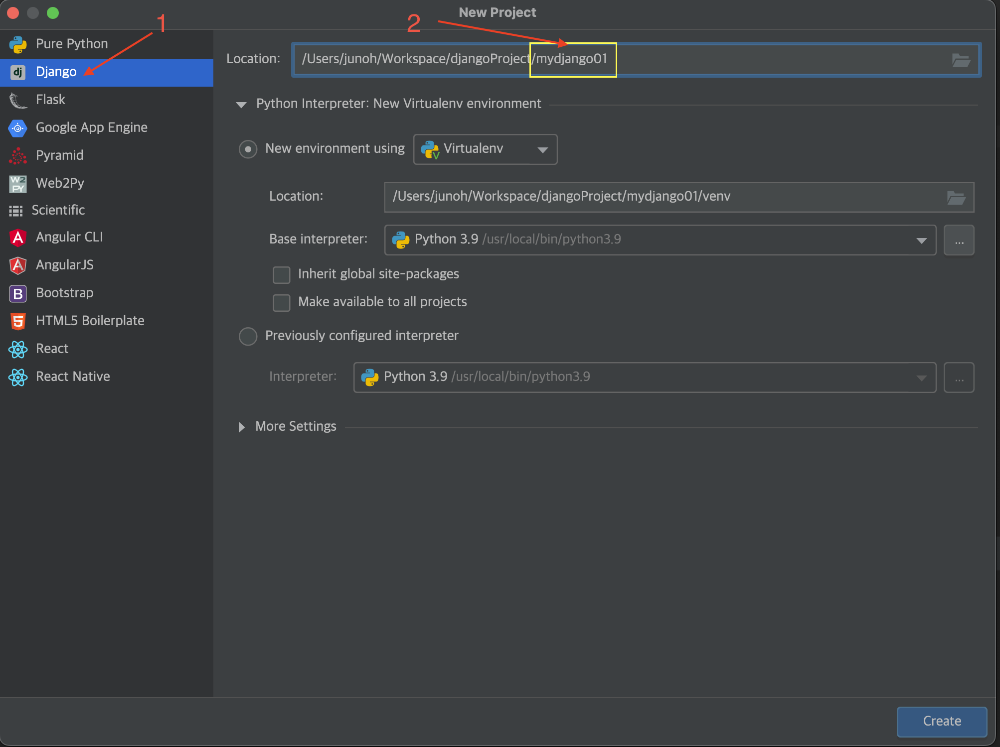
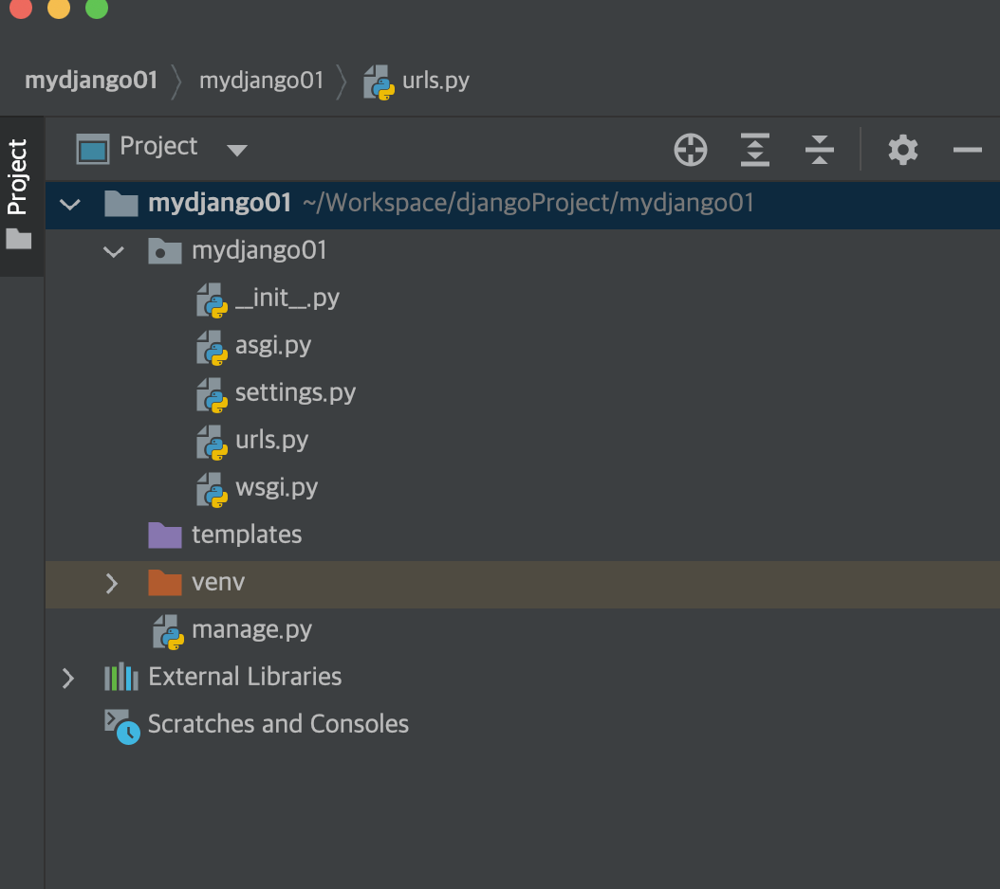
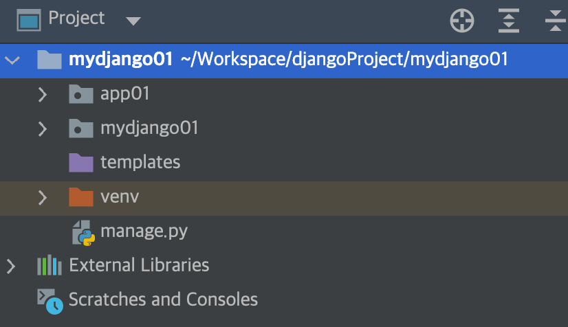
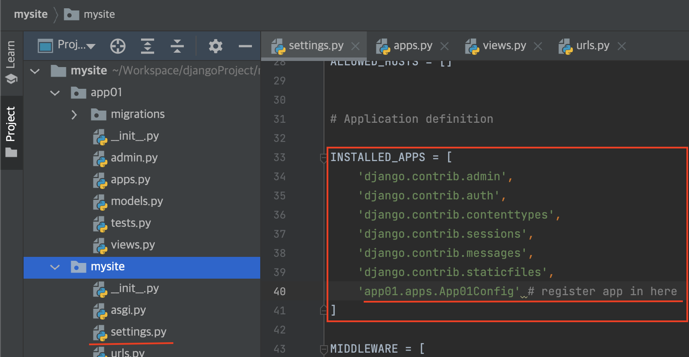
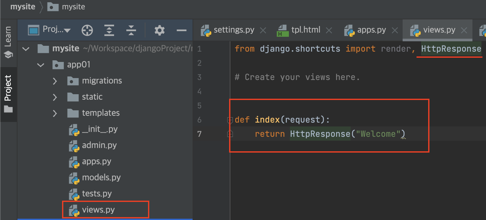
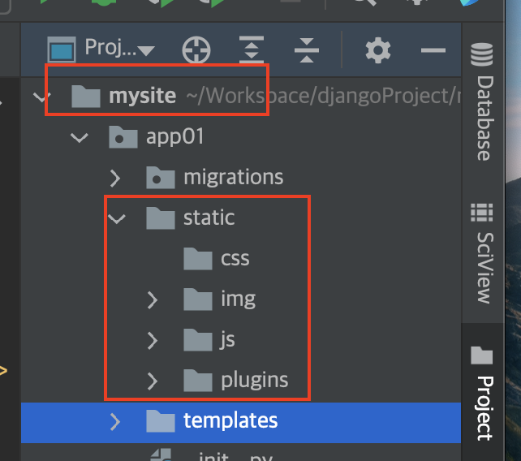

<details>

<summary> Table of Contents</summary>

- [Getting Started](#getting-started)
  - [Before Django Installation](#before-django-installation)
  - [Django Installation](#django-installation)
- [Create a Django Project](#create-a-django-project)
  - [Create Django Project from `Terminal` (Recommanded)](#create-django-project-from-terminal-recommanded)
  - [Create `.venv` Virtual Environment from `Terminal`](#create-venv-virtual-environment-from-terminal)
  - [Create Django Project from `PyCharm`](#create-django-project-from-pycharm)
  - [Default files of a django project (introduction)](#default-files-of-a-django-project-introduction)
  - [Import requirements.txt for a Django project](#import-requirementstxt-for-a-django-project)
- [What is APP?](#what-is-app)
  - [How to create an app by `manage.py`?](#how-to-create-an-app-by-managepy)
  - [How to register a created app in the `settings.py` file ?](#how-to-register-a-created-app-in-the-settingspy-file-)
  - [How to mapping `urls.py` and `views.py`](#how-to-mapping-urlspy-and-viewspy)
  - [How to create view functions in `views.py` file](#how-to-create-view-functions-in-viewspy-file)
- [Running the Django Project](#running-the-django-project)
  - [Create a new **path** in `urls.py` file mapping to the **view function** in the `views.py` file](#create-a-new-path-in-urlspy-file-mapping-to-the-view-function-in-the-viewspy-file)
  - [Django Templates](#django-templates)
  - [GET/POST requests](#getpost-requests)
  - [Example Login page](#example-login-page)
- [`Django REST Framework` Tutorial](#django-rest-framework-tutorial)
  - [`REST` or REpresentational State Transfer Architectural Style](#rest-or-representational-state-transfer-architectural-style)
  - [Status Codes:](#status-codes)
- [`APIs` in the Django REST Framework aka DRF](#apis-in-the-django-rest-framework-aka-drf)
  - [Django REST Framework Installation](#django-rest-framework-installation)
  - [Using the **`DRF API`**](#using-the-drf-api)
- [How to use `Django REST Framework` (`DRF`)](#how-to-use-django-rest-framework-drf)
- [Everything is an Object](#everything-is-an-object)
</details>

## Getting Started

### Before Django Installation

- Configure latest python version
- Can use `pyenv` to manage multiple versions of python

### Django Installation

- Install from Python (pip or pip3)
- Django Files
  - django folder in the `lib` folder, and the **django-admin** in `bin` folder

```sh
    # pip or pip3, both can install 3rd party modules
    > pip install django

    > pip3 install django
```

## Create a Django Project

- Under the django project, usually will see those files

```sh
    > tree ~/djangoProject/
    ├── bin
      ├── activate
      ├── django-admin
      ├── normalizer
      ├── pip
      ├── pip3.11
      ├── python3 -> python
      ├── python3.11 -> python
      └── wheel3.11
    └── lib
    └── python3.11
        └── site-packages
            ├── Django-4.1.2.dist-info
            ├── django
            ├── pip
            ├── pip-22.2.2.dist-info
            └── wheel-0.36.2.dist-info
```

### Create Django Project from `Terminal` (Recommanded)

- Type those commands one-by-one to create the django project

```sh
  > cd ~/Workspace # The directory for all projects
  > mkdir djangoProject # The directory for the django project if directory does not existed

  > cd djangoProject
  > django-amdin startproject mydjango01 # create a Django project

  > cd mydjango01
  > django-admin startapp app01 # create an app inside of the Django project

  > . code # open the project in vscode

```

### Create `.venv` Virtual Environment from `Terminal`

- Using the latest `python3` to create `.venv`
- `.venv` manages 3rd-party package easily
  - such as **Django REST Framework**

```sh
  > cd ~/Workspace/djangoProject/mydjango01
  > python3.11 -m venv .venv # python3.11 is the current latest version

  # source is the IMPORTANT Step
  > source ./venv/bin/activate # active the python3 for the project
```

- Install requirements.txt if needed using `pip` or `pip3`

```sh
  # sometimes, needs to update pip version
  > pip3 install --upgrade pip

  # pip3 freeze > requirements.txt
  > pip3 install -r requirements.txt
```

- Run the project in the `vscode`, for example ~/Workspace/djangoProject/mydjango02

```sh
  # run code command under the project directory,
  > code .

```

### Create Django Project from `PyCharm`

- Two images show the steps of createing projects

<!--  -->

<!--  -->


- Creating a project by the PyCharm will be generating some files that are not using often
  - such `asgi.py`, and `wsgi.py`, etc..
- The project created by the PyCharm needs to delete the default template folder (if needed)

### Default files of a django project (introduction)

- `manage.py` file is automatically create in each Django project.
- `manage.py` file does same thing as **`django-admin`**
- `manage.py` file also sets the **`DJANGO_SETTINGS_MODULE`** environment variable so that points
- to projects' `settings.py` file.

```sh
    ❯ tree -L 3 .
    .
    └── mydjango01
        ├── manage.py # IMPORTANT, Project management, Start Project, Create apps, Database management
        └── mydjango01
            ├── __init__.py
            ├── settings.py # project configuration (modifying often)
            ├── urls.py # corrspondance b/w url and view functions (modifying often)
            └── wsgi.py # receive the submitting requests (DONOT touch)

2 directories, 5 files

```

### Import requirements.txt for a Django project

- `requirements.txt`, to install all 3rd-party packages by using `Terminal` inside of the PyCharm

```sh
  pip install -r requirements.txt
  # or
  pip3 install -r requirements.txt
```

## What is APP?

- The unique and fully managed app structure
- Apps can be created like a completely independent module for every functionality
- Django apps are reusable,and can be (**IMPORTANT, each app can have an individual database table**)
- Assume a Django Project, it can have many apps for different purposes, and features.
  - a user management module,
  - an order management module,
  - an admin module,
  - a website page,
  - APIs ..
  - \*\*\* All Apps can have individual `tables`, `functions`, `HTML page`, and `CSS`... etc.
  - \*\*\* Usually a huge django project have many Apps.

### How to create an app by `manage.py`?

- In the `Terminal` under the project directory

- Type the command to create an `App` folder under the project directory

```sh
	# The command will create a folder named app_name with a few files inside of folder
  	> python3.11 manage.py startapp app_name

```

<!-- -->


```sh
  ❯ tree ./app01
  ./app01
  ├── app01  # this is an APP in the project
  │   ├── __init__.py
  │   ├── admin.py  # DONOT touch
  │   ├── apps.py # DONOT touch
  │   ├── migrations #DONOT touch, for changes of models into database schema
  │   │   └── __init__.py
  │   ├── models.py # Operations of database and write as classes inside of models.py
  │   ├── tests.py # for testing DONOT touch
  │   └── views.py # IMPORTANT, The view functions are coding in here
  ├── manage.py
  ├── mydjango01 # this is an APP in the project
  │   ├── __init__.py
  │   ├── __pycache__
  │   │   ├── __init__.cpython-39.pyc
  │   │   └── settings.cpython-39.pyc
  │   ├── asgi.py
  │   ├── settings.py
  │   ├── urls.py # coopreate with the views.py [URL--> view functions]
  │   └── wsgi.py

```

### How to register a created app in the `settings.py` file ?

- Find `INSTALLED_APPS` in the `settings.py` file
- Add the app that going to be coded.

```Python
  # code in the settings.py
  # Application definition
  INSTALLED_APPS = [
       ...
      'app01.apps.App01Config' # add to here
      # or
      'app01'
  ]
```

<!--  -->


### How to mapping `urls.py` and `views.py`

- The `urls.py` and `views.py` files are involved
  - Import `from app01 import views` the `urls.py` file
  - Find `urlpatterns` in the `urls.py` file, add **paths** for view functions
  - `URL dispatcher`,
  - add a path that going to be coded, **mapping the url --> function in views.py**
  - This module is pure Python code and is a mapping between `URL path` expressions to view functions

```Python
    # code in the urls.py
    urlpatterns = [
      # path('admin/', admin.site.urls),

      # the path is for mapping the url in the urls.py --> function in the views.py
    # when user access the URL index/, the URL goes to views.py file to find the view function "index"
      path('index/', views.index),
    ]
```

<!--  -->


### How to create view functions in `views.py` file

- The `views.py` file is involved,
  - Import `from django.shortcuts import render, HttpResponse` to the `views.py` file
  - The view function that going to be implemented is based on the **path** that created in `urls.py` file
  - <span style="color:red">**IMPORTANT**</span> The `views.py` file contains all view functions, is a Python function that takes a web request and returns a web response.
  - <span style="color:red">**IMPORTANT**</span> The view function `index` below that is corresponding to the `paths` in the `urls.py` file

  ```Python
      def index(request):
      return HttpResponse("Welcome")
  ```

<!--  -->


## Running the Django Project

- Running Django Server in the `Terminal`

  - Run command `python3.11 manage.py runserver`

  ```sh
      ❯ python3 manage.py runserver
      Watching for file changes with StatReloader
      Performing system checks...

      System check identified no issues (0 silenced).
      October 13, 2022 - 16:45:01
      Django version 4.1.2, using settings 'mysite.settings'
      Starting development server at http://127.0.0.1:8000/
      Quit the server with CONTROL-C.

  ```

- Running by the PyCharm
  - NONE

### Create a new **path** in `urls.py` file mapping to the **view function** in the `views.py` file

- `urls.py`, `views.py` and `user_list.html` files are invloved.
  - Add two new **path** `'user/list/'` and `'user/add/'` in the `urls.py` file

    ```Python
    # create an new page
    path('user/list/', views.user_list),

    path('user/add/', views.user_add),
    ```

  - Add two view functions named `user_list` and `user_add` in the `views.py` file

  ```Python
    def user_list(request):
      # request is from the URL, it will look for the user_list.html file from all template folders.
        # based on the order of registered apps, see settings.py file
      return render(request, "user_list.html")

    def user_add(request):
      return HttpResponse("Add User")
  ```

  <!--  -->
  

- in the **template** folder, add a html page named `user_list.html`

  - How to load static resouces suchas `img`, `css`, `js`
  - Add **``** to the head of the `html` page
  - Avoid the absolute path in the html page

  ```django
  
  <!-- load static folder, this is good for when static folder is changed location //-->
  <!DOCTYPE html>
  <html lang="en">
    <head>
      <meta charset="UTF-8" />
      <title>User List</title>
      <link
        rel="stylesheet"
        href=""
      />
    </head>
    <body>
      <h1>User List</h1>
      <input type="text" class="btn btn-primary" value="Create" />
      
      <script src=""></script>
      <script src=""></script>
    </body>
  </html>
  ```

  <!--  -->
  

### Django Templates

- Using the `template` in html page
- The `urls.py`, `views.py`, and `tpl.html` files are involved
- Add a **path** in the `urls.py` file

```Python
# create a path for using template
path('tpl/', views.tpl),
```

- Add a **view function** `tpl` in the `views.py` file

```Python
# using list and dictionary from Python
def tpl(request):
  name = "JohnDoe"
  role = ["Admin", "CEO", "CTO"]  # the list
  user_info = {"name": "Bella", "salary": 100000, 'role': "CTO"}  # the dictionary

  # dictionary in a list
  data_list = [
  {"name": "Abby", "salary": 80000, 'role': "CFO"},
  {"name": "Bella", "salary": 40000, 'role': "CAO"},
  {"name": "Cathy", "salary": 80000, 'role': "CTO"},
  ]
  # return all requests by the dictionary format
  return render(request, 'tpl.html', {"n1": name, "n2": role, 'n3': user_info, "n4": data_list})
```

- Create a new page **tlp.html** for `Django templates`

```django
<!DOCTYPE html>
<html lang="en">
  <head>
    <meta charset="UTF-8" />
    <title>Title</title>
  </head>
  <body>
    <h1>Learning template syntax</h1>
    <!-- n1 is the variable name in the view function "tpl" -->
    <div>{{ n1 }}</div>
    <div>{{ n2 }}</div>
    <div>{{ n2.0 }}</div>
    <div>
      
      <span></span>
      
    </div>
    <!-- for loop get the elements from the list-->
    <hr />
    {{ n3 }}
    <!-- show full dictionary -->
    {{ n3.name }}
    <!-- show the value by using keys-->
    {{ n3.role }} {{ n3.salary }}
    <ul>
      
      <li>{{ k }} = {{ v }}</li>
      
    </ul>
    <!-- get the key and value of dictionary by for loop-->

    <hr />
    {{ n4 }}
    <!--get the all dictionaries in  "data_list -->
    {{ n4.0 }}
    <!-- get the first dictionary in the data_list-->
    {{ n4.1.name }}
    <!-- get the name form the second dictionary-->
    {{ n4.1.role }}
    <!-- get the role form the second dictionary -->
    ,
    <div>{{ item.name }} {{ item.salary }}</div>
     <！-- iterate all dictionaries in the data_list to get name and
    salary-->

    <hr />
    
    <h1>You are a John Doe user.</h1>
    
    <h1>You are ChinaJoe</h1>
    
    <h1>You are a noname user</h1>
    
  </body>
</html>
```

### GET/POST requests

- `urls.py`, `views.py` are involved
- Add a **path** to `urls.py`,

```Python
from django.urls import path
from app01 import views

# request and response
path('request_and_response/', views.request_and_response),
```

- Add a **view function** `request_and_response` to `views.py` file

```Python
from django.shortcuts import render, HttpResponse, redirect
import requests
# import the classes of models from app01.models.py
from app01.models import UserInfo, Department


# GET/POST, HttpResponse, render, and redirect
# Request and Response
def request_and_response(request):
# request if an object, it has all data user requests

# Using the GET/POST requests
print(request.method)

# Send parameters on the URL such
print(request.GET)

print(request.POST)

# these are responses
return HttpResponse("Return")  # this will response back all user requests

return render(request, 'request_and_response.html', {"title": "ChinaJoe"})

return redirect("https://www.google.com")
```

### Example Login page

- `urls.py`, `views.py` , and `login.html` files are involved
- Add a **path** `login/` to `urls.py` file

```Python
from django.urls import path
from app01 import views

# login
path('login/', views.login),
```

- Add a **view function** `login(requestion)` to `views.py` file

```Python
# Login function
def login(request):
  # if it is a GET request, send out the login.html page
  if request.method == "GET":
    return render(request, "login.html")
  else:
    # If it is a POST request, get the user submit for login
    print(request.POST)
    username = request.POST.get("user")
    password = request.POST.get("pwd")

    if username == "root" and password == "123":
      # return HttpResponse("Logged in. Welcome")
      return redirect("https://www.apple.com")
    else:
      # return HttpResponse("Unsuccessful, Check your inputs!!!")
      # if login failed, return login.html page again for re-login and a prompt
      return render(request, "login.html", {"error_msg": "Unsuccessful, Check your inputs!!!"})
```

- Create a new page **login.html**

```django
<!DOCTYPE html>
<html lang="en">
  <head>
    <meta charset="UTF-8" />
    <title>Login Page</title>
  </head>
  <body>
    <h1>Customer Login</h1>
    <form method="post" action="/login/">
      
      <!--For validating login request -->
      <input type="text" name="user" placeholder="Username" />
      <input type="password" name="pwd" placeholder="Password" />
      <input type="submit" value="Submit" />
      <span style="color: red">{{ error_msg }}</span>
    </form>
  </body>
</html>
```

- Avoid **Forbidden (403)** error

```django
<!-- add csrf_token to the code -->
 <!--For validating login request -->
```

## `Django REST Framework` Tutorial

### `REST` or REpresentational State Transfer Architectural Style

- 表現層狀態轉換
- an architectuaral style for providing standards between computer systems on the web,
- making it easier for systems to communicate with eatch other.
- A `web API` that obeys the `REST constraints` is informally described as `RESTful`
- especially for the data transferring back and forth front-end, and back-end

<!--  -->


### Status Codes:

- [Status Codes Reference:](https://www.django-rest-framework.org/api-guide/status-codes/)
- HTTP_100_CONTINUE
- HTTP_101_SWITCHING_PROTOCOLS
- HTTP_200_OK
- HTTP_201_CREATED
- HTTP_202_ACCEPTED
- 4xx, Client Error
- 5xx, Server Error

## `APIs` in the Django REST Framework aka DRF

- What is the `REST API`?
  - REST API is a way of accessing web services in a simple and flexible way without having any processing.

### Django REST Framework Installation

- Install 3rd-party package
- <span style="color:LightGreen" font-size:16px> **Recommended**: </span>, create a **`.venv`** before install packages

```sh
    $ pip install djangorestframework
    # or
    $ pip3 install djangorestframework 
```

### Using the **`DRF API`**

- A request is sent from client to server in the form of a web URL as `HTTP` `GET` or `POST` or `PUT` or `DELETE` request.

## How to use `Django REST Framework` (`DRF`)

- `models.py`, `serializers.py`, `urls.py`, `settings.py`, and `views.py` are involved
  - Edit the settings module **`settings.py`** file
    - Importing apps and the 3rd-party packages are NECESSARY
    - the `rest_framework` MUST be imported before using it

```python
    INSTALLED_APPS = [
        # ...

        "app01", # importing the self-defined app
        "rest_framework" # importing the 3rd-party package rest_framework
    ]
```

- Edit the **`urls.py`** router (url) file

```python
    from django.contrib import admin
    from django.urls import path, include
    from app01 import views
    from rest_framework.routers import DefaultRouter

    # router
    router = DefaultRouter()
    router.register('books', views.BookViewSet)

    urlpatterns = [
        path("admin/", admin.site.urls),

        # path('book/', include("app01.app01.urls"))
    ]
    # add both list of urls together
    urlpatterns += router.urls
```

- Edit the **`views.py`** file

```python
    from rest_framework.viewsets import ModelViewSet
    from .models import Book
    from .serializers import BookModelSerializer
    # create your views here
    class BookViewSet(ModelViewSet):
        queryset = Book.objects.all()
        serializer_class = BookModelSerializer
```

- Edit the **`models.py`** file

```python
    from django.db import models
    """ the Book class is the table model which will create a Book table in the database."""
    class Book(models.Model):
        book_id = models.AutoField(primary_key=True)
        book_name = models.CharField(max_length=64)
        price = models.DecimalField(max_digits=5, decimal_places=2)
        author = models.CharField(max_length=64)

        class Meta:
            managed = True
            db_table = 'Book'

```

- Create and edit the **`serializers.py`** file
  - the `serializers.py` file provides complex data such as **querysets** and **model instances** to be converted to native Python datatypes that can then be easily rendered into JSON, XML or other content types.
  - Serializers also provide **`deserialization`**, allowing parsed data to be converted back into complex types, after first validating the incoming data.

```Python
    from rest_framework.serializers import ModelSerializer
    from app01.models import Book
    class BookModelSerializer(ModelSerializer):
        class Meta:
            model = Book
            fields = "__all__"
```

## Everything is an Object

```python
    def foo(x, y):
        return x + y

    foo.name = "foo" # a method is an object as well
    # a method name can be assigned to the foo method

    print(foo(2,3))

    print(foo.name) # since the name is assigned, we can print it out as well.
```

