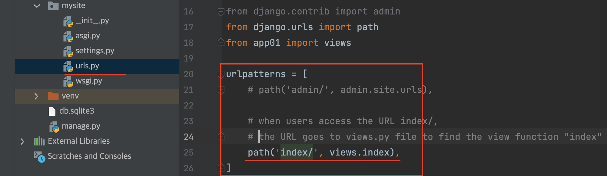
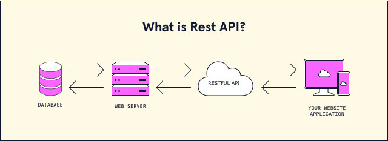

<details>

<summary> Table of Contents</summary>

</details>

## `REST` or REpresentational State Transfer Architectural Style
- 表現層狀態轉換
- an architectuaral style for providing standards between computer systems on the web, 
- making it easier for systems to communicate with eatch other.
- A `web API` that obeys the `REST constraints` is informally described as `RESTful`
- especially for the data transferring back and forth front-end, and back-end

<!--  -->


### Status Codes:
- [Status Codes Reference:](https://www.django-rest-framework.org/api-guide/status-codes/)
- HTTP_100_CONTINUE
- HTTP_101_SWITCHING_PROTOCOLS
- HTTP_200_OK
- HTTP_201_CREATED
- HTTP_202_ACCEPTED
- 4xx, Client Error
- 5xx, Server Error
  
## APIs in Django REST Framework

- What is the `REST API`?
  - REST API is a way of accessing web services in a simple and flexible way without having any processing.

### Django REST Framework Installation
  - Install 3rd-party package
  - **Recommended**, create a **`.venv`** before install packages
  
```sh
    $ pip install djangorestframework
```

### Using **`REST API`** 
- A request is sent from client to server in the form of a web URL as `HTTP` `GET` or `POST` or `PUT` or `DELETE` request.

## How to use `Django REST Framework` aka `DRF`

- `models.py`, `serializers.py`, `urls.py`, `settings.py`, `views.py`
  
- Edit the **`settings.py`** file
  - beause we have to use those apps, 
  - `rest_framework` MUST be imported
  
```Python
    INSTALLED_APPS = [
        # ...

        "app01",
        "rest_framework"
    ]
```

- Edit the **`urls.py`** router (url) file
  
```Python
    from django.contrib import admin
    from django.urls import path, include
    from app01 import views
    from rest_framework.routers import DefaultRouter

    # router
    router = DefaultRouter()
    router.register('books', views.BookViewSet)

    urlpatterns = [
        path("admin/", admin.site.urls),

        # path('book/', include("app01.app01.urls"))
    ]
    # add both list of urls together
    urlpatterns += router.urls
```

- Edit the **`views.py`** file
  
```Python
    from rest_framework.viewsets import ModelViewSet
    from .models import Book
    from .serializers import BookModelSerializer
    # create your views here
    class BookViewSet(ModelViewSet):
        queryset = Book.objects.all()
        serializer_class = BookModelSerializer
```

- Edit the **`models.py`** file
  
```Python
    from django.db import models
    # create a Book table in the database.
    class Book(models.Model):
        book_id = models.AutoField(primary_key=True)
        book_name = models.CharField(max_length=64)
        price = models.DecimalField(max_digits=5, decimal_places=2)
        author = models.CharField(max_length=64)

        class Meta:
            managed = True
            db_table = 'Book'
 
```


- Create and edit the **`serializers.py`** file
  - the `serializers.py` file provides complex data such as **querysets** and **model instances** to be converted to native Python datatypes that can then be easily rendered into JSON, XML or other content types. 
  - Serializers also provide **`deserialization`**, allowing parsed data to be converted back into complex types, after first validating the incoming data.

```Python
    from rest_framework.serializers import ModelSerializer
    from app01.models import Book
    class BookModelSerializer(ModelSerializer):
        class Meta:
            model = Book
            fields = "__all__"
```

## Everything is an Object

```python
    def foo(x, y):
        return x + y

    foo.name = "foo" # a method is an object as well
    # a method name can be assigned to the foo method

    print(foo(2,3))
    
    print(foo.name) # since the name is assigned, we can print it out as well.
```