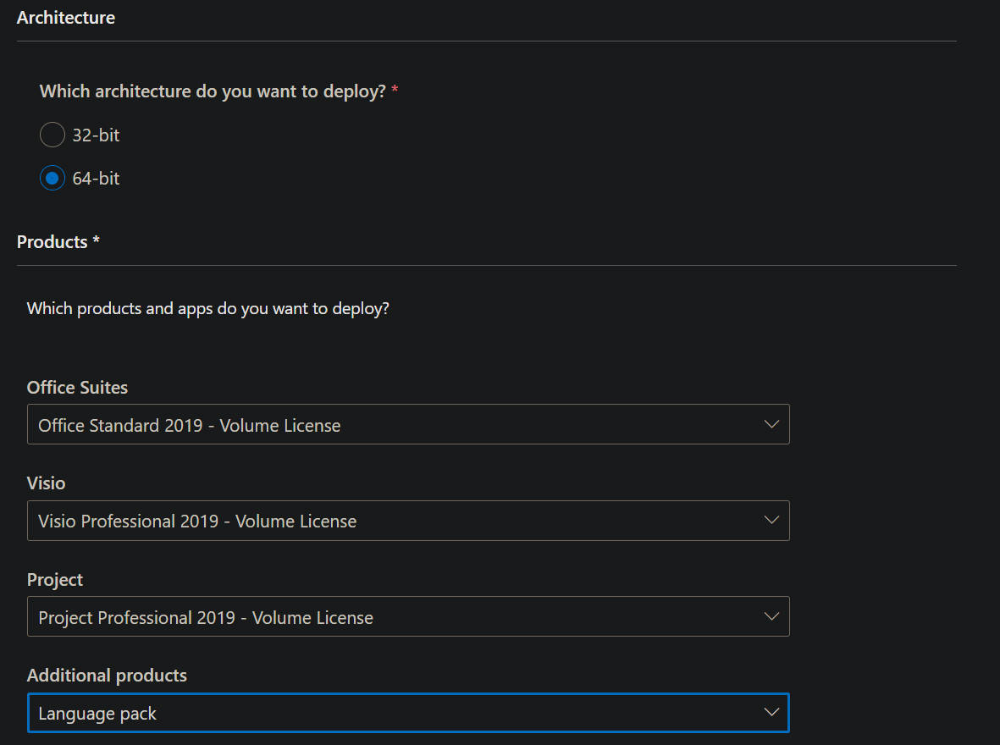
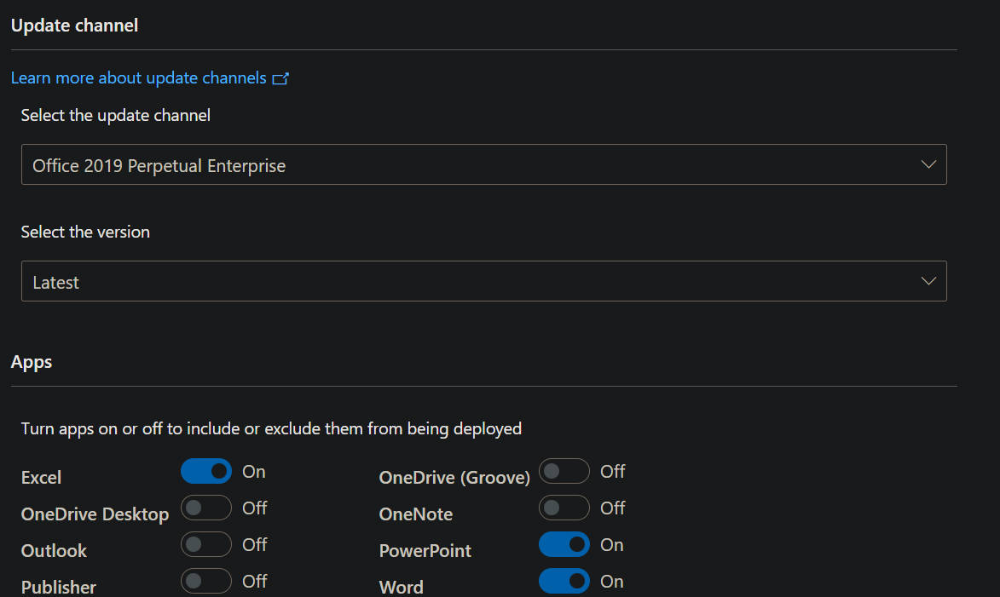
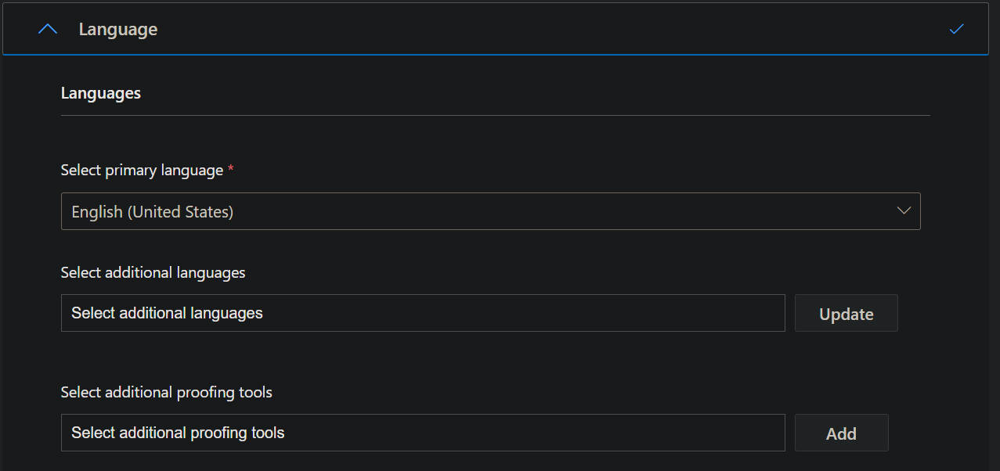
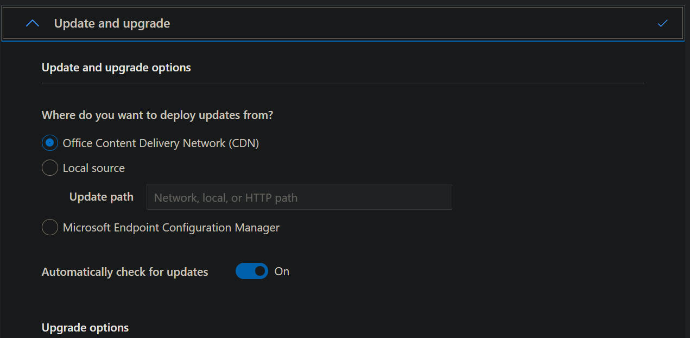
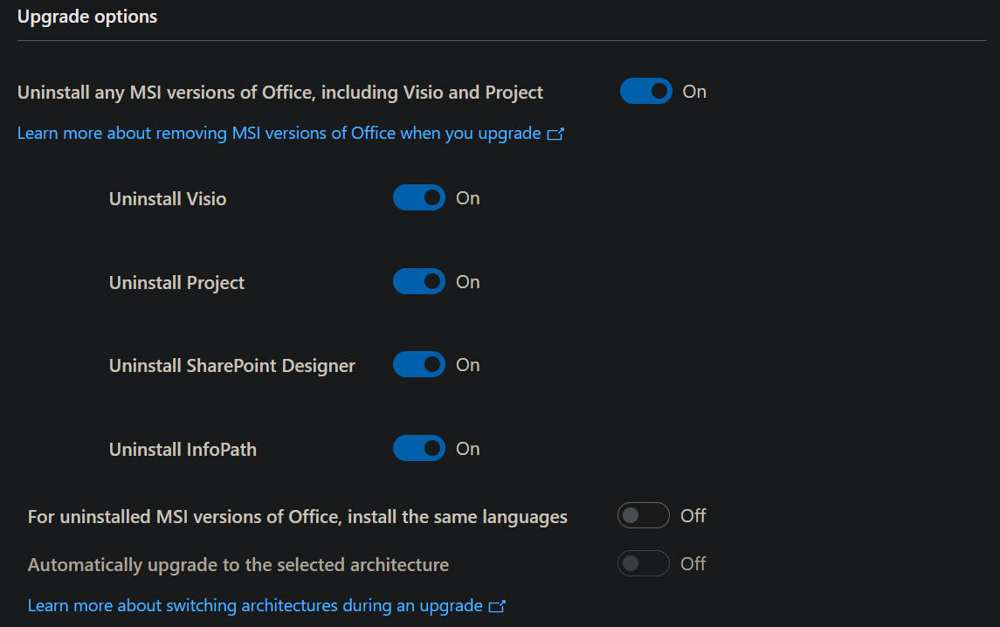
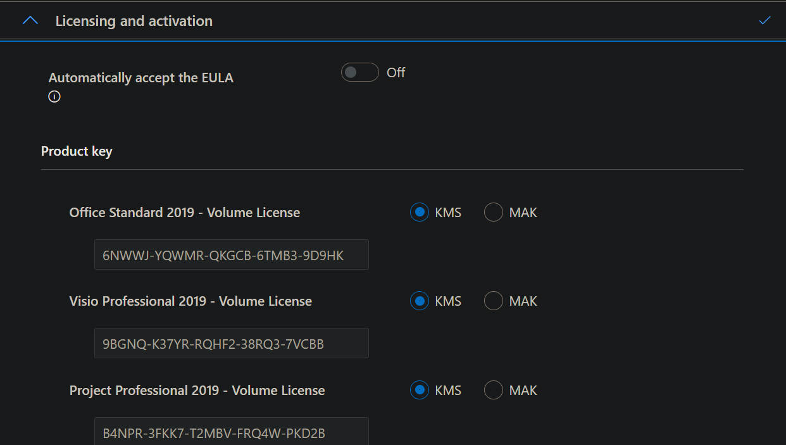
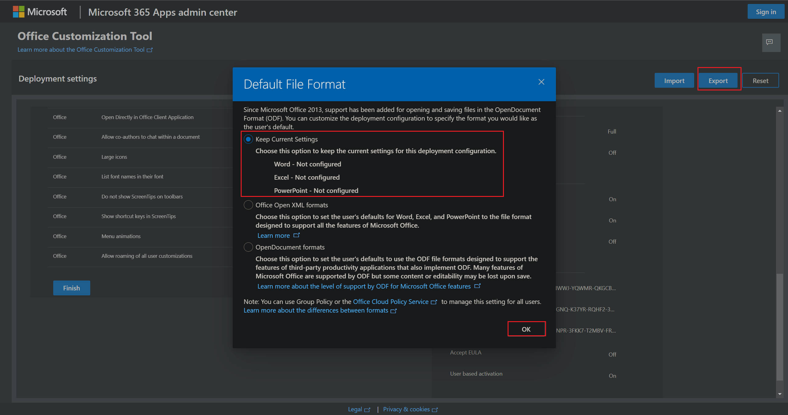
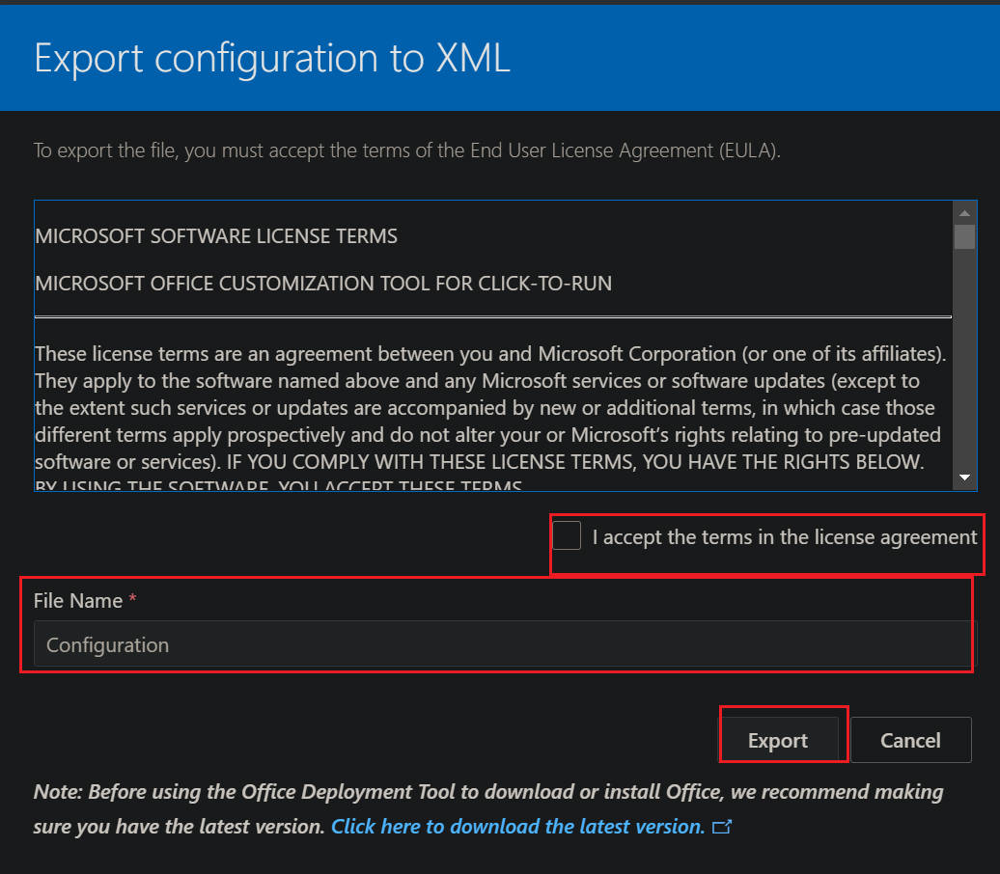

#

## Office Setup

### Microsoft Office (VOL)

- Download Office Deployment Tool

  - [Download link](https://www.microsoft.com/en-us/download/details.aspx?id=49117) Download to Desktop folder.
  - Extract the file to office folder
    `C:\Users\username\Desktop\office`

- Config Deployment Tools
  - [Config](https://config.office.com/deploymentsettings)
  - Export the configuration file (office2019vol_Configuration.xml)










- Terminal(admin) Download office package

```sh
$ cd C:\Users\username\Desktop\office

$ setup /download office2019vol_Configuration.xml
# take a while to download installation package.
# or
$ .\setup.exe /download .\office2019vol_Configuration.xml
```

- Install office software

```sh
$ setup /configure office2019vol_Configuration.xml
# take a while to install the package
# or
 .\setup.exe /configure .\office2019vol_Configuration.xml
```

- Setup KMS server to activate office.
- https://youtu.be/L1YNqxhZBp0
