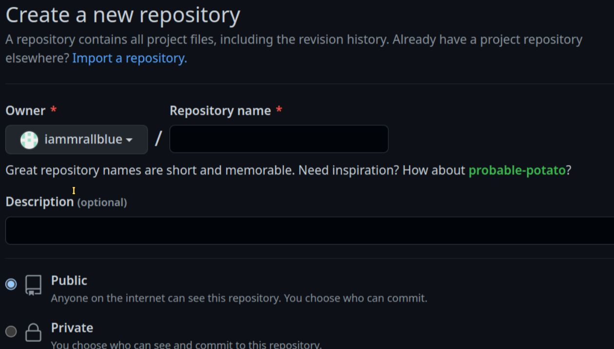

# git_tutorial notes

> git tutorial for beginner

## Git

- A free and open source version control system

### Version Control

- The management of changes to documents, computer programs, large web sites, and other collections of information

### Terms

- `Directory` == Folder
- Terminal or Command Line == Interface for Text Commands
- `CLI` == Command Line Interface
- `Repository` == Project, or the folder/place where is the project at.

## Account Validation

### Validating Account by using `ssh-key`

```sh
$ ssh-keygen -t rsa -b 4096 -C "email@githubaccount.com"
# Generating public/private rsa key pair.
# Enter file in which to save the key (/home/user/.ssh/id_rsa): github_db16
# github_db16 is just the name of public key
```

### Set up github account

- Always setup before using git commands to do version control

```sh
# setup user name
$ git config --global user.name "username"
# setup user email
$ git config --global user.email test@email.com
```

## Basic Commands for Git

updated from vscode.

### `clone` command

- `git clone`, copy a repository from remote to local machine

### `status` command

- `git status` can show the status of all files under the project

```sh
#...
$ git status
```

### `add` command

- `git add .` adding all changes under the current directory
- track your files and changes in `Git`

```sh
# adding all changes
$ git add .
```

### `commit` command

- `git commit -m` means committng all changes with messages
- messages can be all information related to changes.

```sh
# committing all changes
$ git commit -m "msg01" -m "msg02"
```

### `push` command

- `git push` means pushing all changes to remote repository, like **github**

```sh
# pushing all changes
$ git push
```

- `git push origin master` pushing to different branches

### `pull` command

- `git pull` download changes from remote repo to the local machine,
- the opposite of push

### `diff` command

- `git diff`to compare the difference of different version of files

```sh
# It will show a b versions of the file
$ git diff README.md
```

### `log` command

- `git log` to show commits
- `--oneline`, This is a shorthand for "--pretty=oneline --abbrev-commit" used together.

```sh
# to show commit log
$ git log --oneline

# result will be like:
65e1480 (HEAD -> main, origin/main, origin/HEAD) Modified README.md
465a079 Added img file for images
d22d1f0 Modified README.md
3c1af99 c++ file
0f0d1f1 Modified README.md
930cc77 Modified README.md
63252da Added demo.c
8b14123 Create README.md
```

### `revert` command

- `git revert` revert back to the specific file version

```sh
$ git revert "hash code"
# has code == 930cc77
```

---

## Project From local machine to remote repository

### When the repo is initialized from local machine

- `git init` initialing a repository in the local machine

```sh
$ cd # to the project directory # the project is myrepo for example
$ git init myrepo
# executed the coomand "git init myrepo" will return hint message
hint: Using 'master' as the name for the initial branch. This default branch name
hint: is subject to change. To configure the initial branch name to use in all
hint: of your new repositories, which will suppress this warning, call:
hint:
hint:   git config --global init.defaultBranch <name>
hint:
hint: Names commonly chosen instead of 'master' are 'main', 'trunk' and
hint: 'development'. The just-created branch can be renamed via this command:
hint:
hint:   git branch -m <name>
```

- The default branch name is `master`, or`main`, it can change.

### The hidden folder `.git`

- when the command `git init myrepo` is executed, the hidden folder `.git` will be generated

- Every repository has a hidden folder `.git`, it contains all information about the repo

  - such as the repo's history, settings etc..

- If removed folder `.git` the repository itself will be no longer a repository
- Without `.git` hidden folder, the repository is just a common directory

### Check status of the repository

- `git status` command

```sh
$ git status
On branch main
Your branch is up to date with 'origin/main'.

Changes not staged for commit:
  (use "git add <file>..." to update what will be committed)
  (use "git restore <file>..." to discard changes in working directory)
        modified:   README.md

no changes added to commit (use "git add" and/or "git commit -a")
```

### Add to the github

- `git add .`, or `git add file01 file02`
- `git add .` be more careful to use this command because it will push all changes to the remote

### Commit all changes

- `git commit -m "msg1" -m "msg2"`

### Push a local repo to the github account

- Error, when the repo is first time pushing from local machine to remote

```sh
$ git_demo git:(master) git push
# fatal: No configured push destination.
# Either specify the URL from the command-line or configure a remote # repository using

    git remote add <name> <url>

and then push using the remote name

    git push <name>

```

- Go to github.com to create a new repository

  

- copy the .git address
  e.g. <https://github.com/iammrallblue/git_demo.git>

- `git remote add` initialing the new local repo to github

```sh
$ git remote add origin https://github.com/iammrallblue/git_demo.git

$ git remote -v
# origin  https://github.com/iammrallblue/git_demo.git (fetch)
# origin  https://github.com/iammrallblue/git_demo.git (push)
#
$ git push origin master
```

- …or create a new repository on the command line

```sh
echo "# git_demo" >> README.md
git init
git add README.md
git commit -m "first commit"
git branch -M main
git remote add origin https://github.com/iammrallblue/git_demo.git
git push -u origin main
```

- …or push an existing repository from the command line

```sh
git remote add origin https://github.com/iammrallblue/git_demo.git
git branch -M main
git push -u origin main

```

### Check `.git/config` file

```sh
➜  git_tutorial git:(main) ✗ cat ./.git/config
[core]
        repositoryformatversion = 0
        filemode = true
        bare = false
        logallrefupdates = true
[remote "origin"]
        url = https://github.com/iammrallblue/git_tutorial.git
        fetch = +refs/heads/*:refs/remotes/origin/*
[branch "main"]
        remote = origin
        merge = refs/heads/main

```

### 110

### 111
